## UML(统一建模语言)

> 事物是对模型中最具代表性的成分的抽象
>
> 关系把事物结合起来
>
> 图聚集了相关的事物

### 事物

分为四种

- 结构事物（名词）

  - 包括 类、接口、协作、用例、主动类、构件、制品、结点

    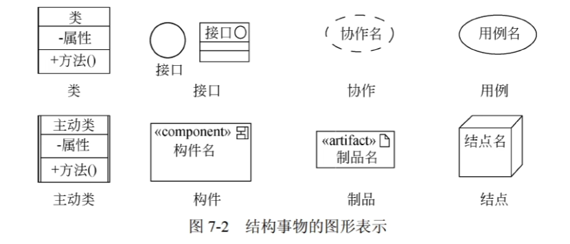

- 行为事物（动词）

  - 包括 交互、状态机、活动

    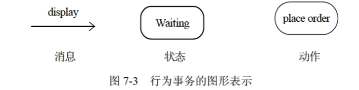

- 分组事物（组织）

  - 最主要的分组事物是 包，包存粹是概念上的

- 注释事物

  - 用于描述、说明、标注模型的任何元素

    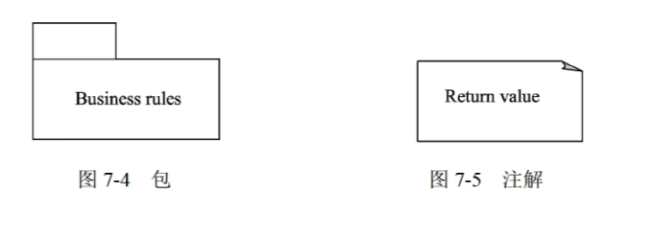

### 关系

#### 依赖

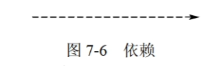

> 有方向的虚线，左依赖于右

- 两个事物间的语义关系，其中一个事物发生变化会影响另一个事物

#### 关联

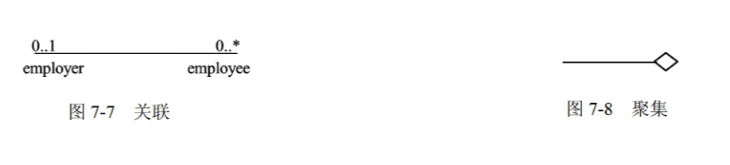

> 上面是重复度，0,  1,  0..1,  0..*
>
> 下面是角色
>
> 聚合的棱形指向整体
>
> 组合的棱形是实心

- **关联**是一种结构关系，描述了一组链，是对象之间的连接。
- **聚合**是一种**特殊的关联**，它描述整体和部分的结构关系。**部分可以脱离整体存在，生命周期不一致**
- **组合**是部分和整体生命周期一致，**部分不可脱离整体存在**

#### 关联的补充

- 单向关联（实线的箭头）

  - 比**依赖**的强度更强，鱼→水，人→氧气

- 关联名

  - 关联关系中可在箭头/无向边上写名字，表明关联的关系

- 关联类

  - 增加一个类，可以让关联的两个类能确定唯一记录。

    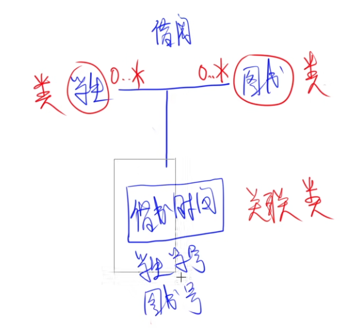

#### 泛化

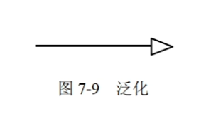

> 子元素（特殊）指向父元素（一般）

- 泛化是一种特殊/一般关系，特殊元素可替代一般元素的对象。

#### 实现

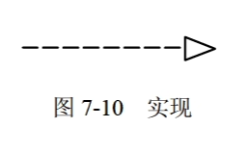

> 类 指向 接口

- 类元之间的语义关系，其中一个类元指定了由另一个类元保证执行的契约。
- 两种情况：接口和对应的类/构件。用例和对应的协作。

📒 从题中的总结

- 关联描述了一组链，两个类之间**可以有多个由不同角色标识的**关联
- 聚合对象是指一个对象**包含其他对象**

### 图

#### 类图（类和类之间的关系）

- 展示一组对象、接口、协作和他们之间的关系。类图给出系统的**静态设计视图**。

- 通常以下三种方式使用类图
  - 对系统的词汇建模

  - 对简单的协作建模

  - 对逻辑数据库模式建模

- 内部：

  - \+ 公有的

  - \- 私有的
  - \# 受保护的

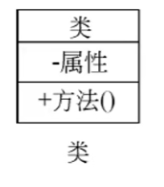

📒 从题中的总结

- 抽象类的**非直接对象**是子类；抽象类没有直接对象。

#### 对象图（某时刻，对象之间的关系）

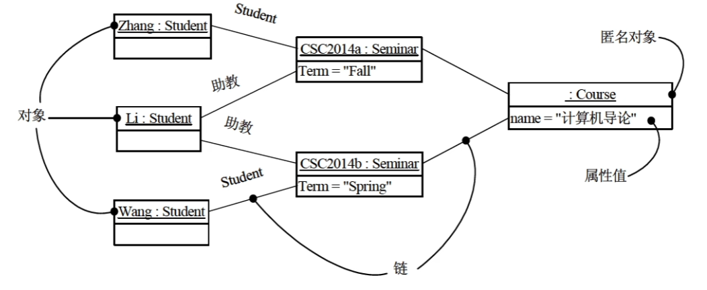

- 描述了在类图中所建立的事物的实例的静态快照。
- 对象图一般包括**对象和链**
- 对象图中的类**只有类名和属性，没有方法**
  - 类名是`Zhang:Student`形式，即`实例名:类名`
  - 属性已经赋值，具有具体的值

#### 用例图（用例、参与者之间关系）

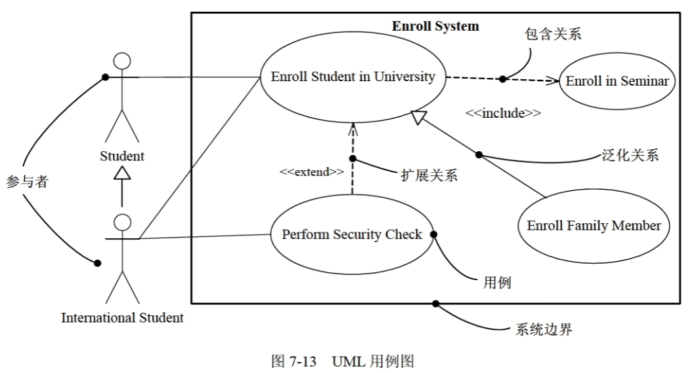

- 展示一组用例、参与者及他们之间的关系。
- 对系统的**静态用例视图**建模，一般有两种方式
  - 对**系统语境**建模
  - 对**系统需求**建模
- 用例图通常包含以下内容
  - 用例 *（椭圆）*
  - 参与者
  - 用例之间的**扩展\<\<extend\>\>**、**包含\<\<include\>\>**关系
  - 参与者与用例间的关联关系
  - 用例和用例、参与者与参与者之间的泛化关系

- 包含关系
  - 虚线箭头 + \<\<include\>\>
  - 由**基本用例**指向**被包含用例**
- 扩展关系
  - 一个用例执行时，可能会发生一些特殊的情况或可选的情况，这种情况就是这个用例的扩展用例。
  - 虚线箭头 + \<\<extend\>\>
  - **扩展用例**指向**基本用例**
- 泛化关系
  - 实心线 + 空心三角
  - **子类（特殊）**指向**父类（一般）**

> 泛化一定会实现一种
>
> 扩展不一定会实现

~~上面是静态图，下面是动态图~~

~~上面是静态图，下面是动态图~~

~~上面是静态图，下面是动态图~~

**交互图**

- 对系统的动态方面进行建模，表现的是一个交互。由一组对象和他们之间关系组成。表现为序列图、通信图、交互概览图、计时图
- 通常包含对象、链、消息

#### 序列图（顺序图）

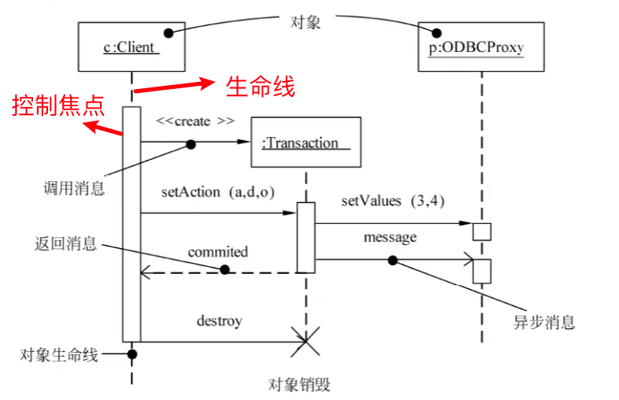

- 是场景的图形化表示，以时间顺序组织的对象 之间的交互活动
- 对象放最上方，发起交互在左，下级依次在右。对象有**生命线**，是一条垂直的虚线。
- 发送/接收的消息沿垂直方向顺序从上向下放置。
- 序列图有**控制焦点**，是一个瘦高的矩形，对象执行一个动作所经历的时间段。
- 消息：
  - 同步消息
  - 异步消息
  - 返回消息（虚线）

📒 从题中的总结

- xxx应该实现的方法：指向xxx生命线的**方法**。
- 序列图用于展示系统的**多个用例和多个对象的行为**

#### 通信图（协作图）

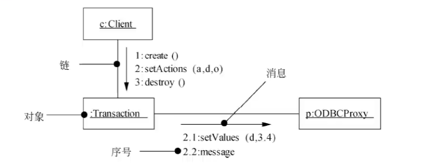

- 强调收发消息的对象的结构组织，强调**参加交互的对象的组织**
- 通信图有路径，对象与对象可又一个路径构造性（例如\<\<local\>\>）
- 通信图有顺序号，表示一个消息的时间顺序
- 通信图和序列图是同构的，他们之间可以相互转换。

#### 状态图

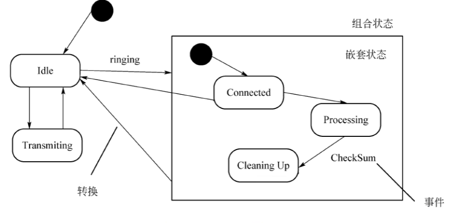

- 展现了一个状态机，由状态、转换、事件和活动组成。**关注系统的动态视图**，**通常是对反应型对象进行建模**。

- 活动（动作）可以在状态内执行，也可以在状态转换时执行

- **状态** 

  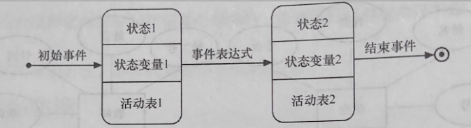

  - 是任何可以被观察到的系统行为模式
  - 初态 ●，只有一个
  - 终态 ◉，多个或没有
  - 状态用圆角四边形表示
    - 上-状态名称
    - 中-状态变量的名称和值（可选）
    - 下-活动表（可选），语法格式：`事件名（参数表）/动作表达式`
      - 三个标准事件：
      - 进入状态`entry入口` 
      - 退出状态`exit出口` 
      - 处于该状态 `do内部活动`

- **事件**

  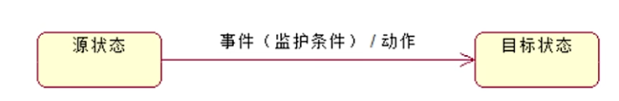

  - 包含两个状态（源状态、目标状态）、事件、监护条件、动作
  - 某个特定时刻发生的事情，**触发状态转换**。
  - `事件（监护条件）/ 动作`，监护条件为真，才会发生动作。转换开始时执行该表达式。

📒 从题中的总结

- `when ( xx )`是时间事件

#### 活动图

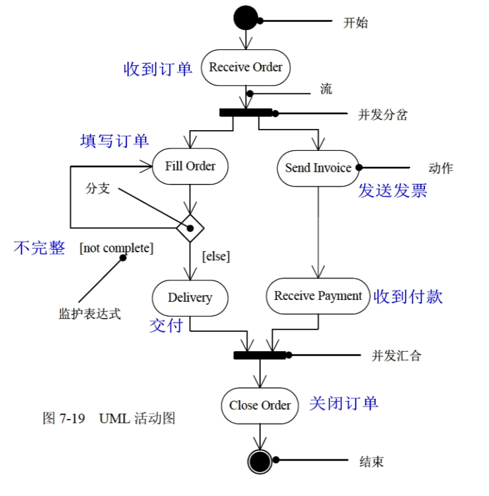

- 是一种特殊的状态图，展示系统内从一个活动到另一个活动的流程。
- 一般包括活动状态、动作状态、转换和对象
- 活动图专注于系统的**动态视图**，对于系统建模特别重要，强调对象间控制流程
- **对工作流建模，对操作建模**

📒 从题中的总结

- 对一个复杂用例中的业务处理流程进行进一步建模的最佳工具是**活动图**

#### 构件图（组件图）

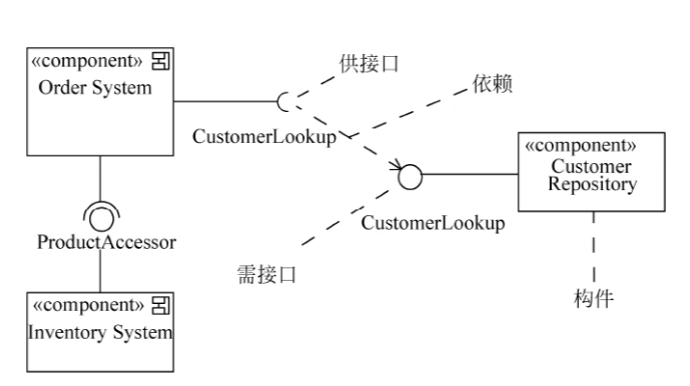

**上图供/需接口标记反了**

- 展示一组构件之间的组织和依赖，专注于系统的**静态实现视图**。

#### 部署图

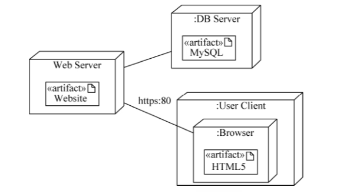

- 对面向对象系统的物理方面进行建模，对静态部署视图进行建模。
- 部署图通常在**实施**阶段使用，展示了**软件和硬件**之间的关系

📒 从杂题中的总结

- 业务用例和参与者一起描述**组织支持的业务过程**，而业务对象模型描述**业务结构及结构元素如何完成业务用例**
- UML中接口可用于声明**对象类所需要的服务**
- 

> 总结 from Kimi

| 图类型 | 作用                                                         | 差异                                                         |
| :----- | :----------------------------------------------------------- | :----------------------------------------------------------- |
| 类图   | - 展示系统的静态设计视图 - 描述类、接口及其关系 - 用于建模系统的词汇、协作和数据库模式 | - 关注系统的结构，不涉及动态行为 - 侧重于类和接口的定义及关系 |
| 对象图 | - 展示系统某时刻的静态快照 - 描述对象及其关系 - 用于验证类图的实例化 | - 关注对象实例，而非类的定义 - 通常用于特定场景的描述     |
| 用例图 | - 展示系统的功能需求 - 描述参与者与用例之间的关系 - 用于需求分析和系统语境建模 | - 关注系统的功能需求，不涉及内部实现 - 侧重于参与者与用例的交互 |
| 序列图 | - 展示对象之间的交互顺序 - 用于建模系统的动态行为 - 用于描述用例的场景 | - 强调时间顺序和消息传递 - 不关注对象的结构组织           |
| 通信图 | - 展示对象之间的结构组织和消息传递路径 - 用于建模系统的动态行为 | - 强调对象之间的组织关系 - 不关注时间顺序                 |
| 状态图 | - 展示单个对象的状态转换 - 用于建模反应型对象的行为       | - 关注单个对象的动态行为 - 不涉及对象之间的交互           |
| 活动图 | - 展示系统内活动的流程 - 用于建模工作流和业务处理流程     | - 关注系统的整体流程 - 不涉及单个对象的内部状态           |
| 构件图 | - 展示构件之间的组织和依赖关系 - 用于建模系统的静态实现视图 | - 关注系统的实现结构 - 不涉及运行时行为                   |
| 部署图 | - 展示系统的物理部署视图 - 用于建模软件和硬件之间的关系   | - 关注系统的物理环境 - 不涉及系统的逻辑结构               |

