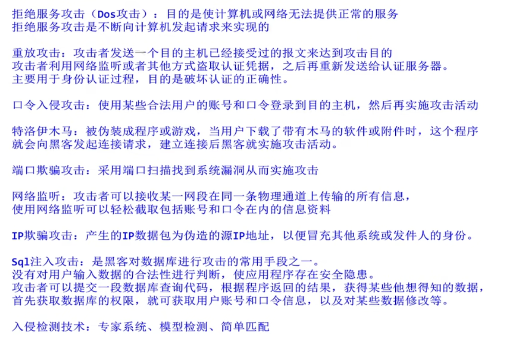

## 信息安全

### 防火墙

- 防止不希望的、未被授权的进出被保护的内部网络
- 内部网络 ➡️ DMZ ➡️ 外部网络。通常把 **公共服务（例如web服务器）** 放置于DMZ域
- 包过滤防火墙。
  - 数据包（**网络层**）过滤根据数据包头进行过滤，无法控制内容。
  - 对用户**透明**
  - 可识别IP源地址、目的地址、协议端口
  - 不能防范黑客工具
- 应用代理网关防火墙。
  - 隔断内外网通信，通信经应用层代理转发。
  - 访问者不能和服务器建立TCP连接。
  - 能对数据包检测，难以配置，处理速度慢。
- 状态检测技术防火墙
  - 结合了上面2的安全性，1的高速度。

📒 从题中的总结

- 防火墙不查毒、不扫描漏洞
- 应用级网关防火墙是内、外部网的隔离点，可对应用层数据进行监控、过滤

### 病毒

- 病毒特性：传播性、隐蔽性、感染性、潜伏性、触发性、破坏性
- `Worm` 蠕虫病毒；`Trojan`特洛伊木马；`Backdoor`后门病毒；`Macro`宏病毒
- 宏病毒感染对象：文档 Word Excel
- 木马病毒：冰河
- 蠕虫病毒：欢乐时光，熊猫烧香、红色代码、爱虫病毒、震网

📒 从题中的总结

- 感染特洛伊木马后典型现象是：有未知程序试图建立网络连接
- X卧底病毒通过木马形式感染智能手机
- 木马程序的客户端运行在攻击者的机器上

### 网络攻击

📒 从题中的总结

- `SYN Flooding`攻击属于Dos攻击
- `SQL`注入攻击的首要目标是获得数据库权限

### 网络安全

- `SSL`是**传输层**安全协议，已经成为一个Web安全标准，端口是**443**
- `TLS`是建立在`SSL3.0`上的，是后续版本
- `SSH`是终端与远程站点建立安全连接的协议，远程登录会话。
- `HTTPS`是以安全为目标的`HTTP`通道，使用`SSL`加密算法的`HTTP`
- `MIME`是多用途互联网邮件扩展类型，是一个互联网标准，扩展了电子邮件标准。
- `PGP(优良保密协议)`是基于`RSA`的邮件加密软件，防止非授权者阅读，数字签名使收信人可以确认邮件发送方。

📒 从题中的总结

- 漏洞扫描系统无法发现网络入侵者
- 数据库容灾属于**系统安全和应用安全**
- IE浏览器中，安全级别最高的区域设置是 **受限站点**
- IIS6.0安全级别最高认证方法是 **集成Windows身份验证**
- 公共端口号：0 - 1023
- 通常使用`IPSec`为IP数据报文进行加密
- `SSH`、`Telnet`、`RFB`可进行远程登录/访问
- `BGP`是外部网关协议