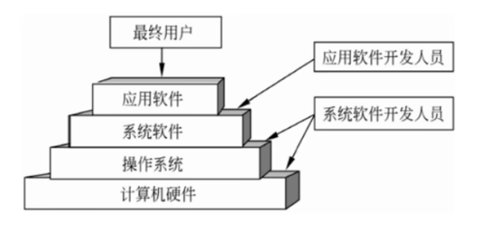
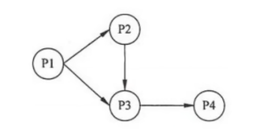
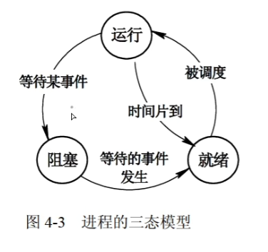
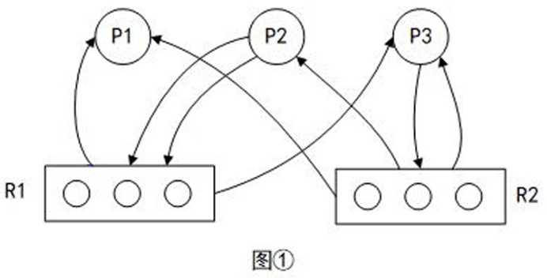
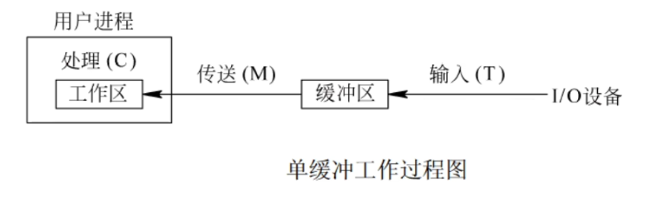
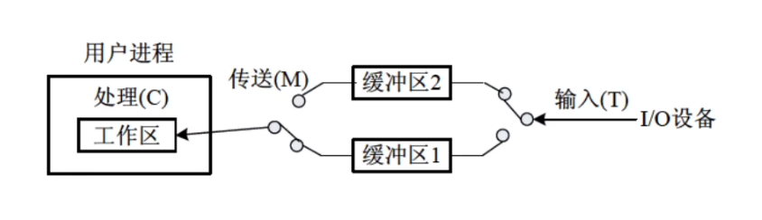
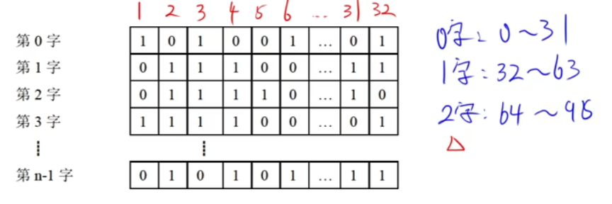

## 操作系统

### 地位

- 系统软件：编辑程序、汇编程序、编译程序、数据库管理软件等
- 操作系统：对硬件系统功能的首次扩充。



### 进程管理

- 进程管理也称处理机管理。是**资源分配和独立运行**的基本单位。

#### 程序与进程

##### 顺序执行

- 前趋图：有向无循环图，由结点和有向边组成。`Pi`和`Pj`的前趋关系表示成`Pi -> Pj`，意味着`Pi`执行结束后`Pj`才能执行。
- 程序顺序执行特征：顺序性、封闭性、可再现性

**前趋图题目**



1. **【确定信号量名称】**有几条有向边需要设置几个信号量，编号S1...Sn，规则为：将`Pi -> Pj`写作`ij(十进制)`，以升序编号。
2. **【确定操作】**对于每个结点(`Pn`)来说，进入`Pn`的是P操作，离开`Pn`的是V操作。
3. 例如对于图上的P3结点，`P(S2) P(S3) -> V(S4)`

##### 并发执行

- 同一个作业内没有前趋关系的程序段或不同作业的程序段可以分别在CPU和各输入/输出部件并行执行。
- 程序并发执行特征：
  - 失去了程序的封闭性
  - 程序和机器的执行程序的活动不再一一对应
  - 并发程序间的相互制约性

##### 进程的状态及其状态间切换

- 三态模型：运行、就绪、阻塞
  - 运行：一个进程在处理机（CPU）运行时
  - 就绪：一个进程获得了除处理机外的一切所需资源，一旦得到处理机即可运行
  - 阻塞：一个进程正在等待某一事件发生而暂时停止运行，即使把处理机分配给进程也无法运行。



- 五态模型：新建 + 终止。`新建 -> 就绪` `运行 -> 终止`

##### 同步与互斥

- 同步是合作进程间的**直接制约**问题，互斥是申请临界资源进程间的**间接制约**问题
- 临界区是进程中对临界资源实施操作的那段程序，4条原则
  - 有空即进
  - 无空则等
  - 有限等待，保证进程在有限的时间进入临界区
  - 让权等待，进程不能进入临界区时，应立即释放处理机

##### 信号量机制和PV操作

- 信号量是整型变量
  - 公用信号量，实现进程间互斥，初值为1或资源的数目
  - 私用信号量，实现进程间同步，初值为0或某个正整数
- 信号量S物理意义
  - S≥0，代表资源可用数
  - S<0，其绝对值代表阻塞队列中等待该资源的进程数
- P操作，`S = S - 1`，申请资源
- V操作，`S = S + 1`，释放资源

##### 利用PV操作实现互斥

- 令信号量S为1，进入临界区时执行P操作，退出时执行V操作

```
P(S)
// do something
V(S)
```

##### 利用PV操作实现同步

- 令信号量S为0，0时代表希望的消息未产生，非0代表希望的消息已经存在

- 多缓冲区同步实现

  - 对于生产者：缓冲区空位S1，
  - 对于消费者：缓冲区剩余产品S2
  - 缓冲区的互斥使用：使用标志位S

  > 生产过程：
  >
  > 生产产品 -> P(S1) P(S) -> 送入缓冲区 -> V(S) V(S2)
  >
  > 消费过程
  >
  > P(S2) P(S) -> 从缓冲区取 -> V(S) V(S1)

##### 死锁

- 系统中m个资源，n个进程共享，每个进程要求k个资源。分配策略为轮流对每个进程分配。不死锁的条件是`m >= n * (k - 1) + 1`

##### 进程资源图



- P为进程，R为资源
- `P -> R`为进程申请资源。 `R -> P`为分配资源给进程
- 先分配再申请
- **题目**
  - 哪些阻塞：先分配后，再申请，如不满足则为阻塞
  - 简化：`P1 P2 P3`非阻塞进程运行完后将资源释放，看后续资源是否够用。如果能运行完则为非死锁

##### 死锁的处理

- 鸵鸟策略（不理睬）
- 预防策略
  - **预先分配**所需资源，保证不等待资源
  - 资源**有序分配**，按顺序排列，保证不形成环路
- 避免策略
  - 银行家算法，如果分配后资源进入不安全状态则不予分配。
  - **做题方法：**首先算出可用的资源数，看哪一个进程用可用的资源能运行起来；运行后释放，再看释放后的资源哪一个进程可运行。
- 检测与解除死锁

### 线程

- 可拥有资源的独立单位；可独立调度和分配的基本单位
- 线程是进程中的一个实体，是被系统独立分配和调度的基本单位
- 线程基本不拥有资源，只拥有一点运行中必不可少的资源，它可和同进程下的线程共享所有资源，**但是线程之间不共享**。

### 局部性原理

- 时间局限性
  - 某条指令执行，不久将来可能再次被执行。因为有循环操作
- 空间局限性
  - 访问了某个存储单元，不久将来其附近存储单元最有可能被访问。因为程序是顺序执行
- 题目**（淘汰表中页号）**
  - 不在内存无法淘汰
  - 优先淘汰未访问过的
  - 优先淘汰未修改过的

### 分页存储管理

- 纯分页存储管理
  - 地址结构页号(4位) + 页内地址(12位)
  - **题目**
    - 给逻辑地址`1C20H`，则1为地址结构页号
    - 去变换表中，将1替换，替换后后为物理地址
- 段页式存储管理
  - 段号 + 段内页号 + 页内地址
  - 题目
    - 最多?段。判断n位，**2^n段**
    - 每个段**最大**?个页。判断页号长度n，**2^n页**
    - 页的大小。地址长度n，**2^n**

### 单/双缓冲区

- 单缓冲区工作流程，在处理C的时候可以进行下一轮的输入，即**TC可以并行**。

- 前提`T + M <= C`，则n轮的时间：`(T + M) * n + C`

  

- 双缓冲区，`T和M、C都可并行`
- 前提`T >= M + C`，n轮时间：`T * n + M + C`



### 磁盘调度算法

- 先来先服务（FCFS）。按照请求顺序访问
- 最短寻道时间优先（SSTF）。贪心算法，访问当前最近的
- 扫描算法（SCAN）或电梯调度算法。选一个方向（大/小），一直朝一个方向进行移动，直到没有了就掉头移动。
- 循环扫描算法（CSCAN）单向扫描算法。选一个方向（大/小），一直朝一个方向进行移动，直到没有了就回到最里面（反向的最后一个），**仍按照相同方向移动**

### 旋转调度算法

- 解题思路：
  - 总时间：
    - 首先看读一个数据+处理数据能否来得及处理下一个数据
    - 通常不行，那就是默认磁盘转一圈只能读一次数据
    - 那总时间为 `一圈时间 * n + 一次处理时间（最后一次）`
  - 优化的最短时间：
    - 读一次数据+处理数据完成后，立即准备进行下一个数据读取
    - 依次排列下去，算总时间

### 多级索引结构

- 直接地址索引。地址直接指向磁盘数据块
- 一级间接地址索引。指向磁盘索引块（1kb，包含256个地址），磁盘索引块每个地址指向磁盘数据块
- 二级间接地址索引。指向2级磁盘索引块，2级磁盘索引块又指向1级磁盘索引块，1级磁盘索引块指向磁盘数据块
- 做题：
  - 确定块数量（直接告诉 / 总大小除以块号大小）
  - 确定数据块大小
  - 确定总的块数

### 文件目录

- 为每个文件设置了用于描述、控制文件的数据结构，至少包括文件名和存放文件的物理地址。这个数据结构称为文件控制块`FCB`，文件控制块的有序集合叫文件目录。
- 文件控制块包含三类信息
  - 基本信息类。例如文件名、文件物理地址
  - 存取控制信息类。文件的存取权限
  - 使用信息类。文件建立日期、修改日期等
- **题目：系统将目录文件修改的结果写回磁盘发生崩溃时，对系统影响较大。**

### 目录结构

- 文件目录结构组织方式直接影响文件的存取速度，关系文件的共享性和安全性。
- 一级目录结构。查找慢，不允许重命名，多用于单用户环境
- 二级目录结构。文件目录+用户目录
- 多级目录结构。`MS-DOS`中分隔符为`\`，`UNIX`中分隔符为`/`
  - 全文件名。绝对路径 + 文件名 `\root\path\index.html`
  - 绝对路径。从根目录开始到当前目录`\root\path\`
  - 相对路径。当前目录 `path\`

### 位示图

- 用二进制的一位来表示一个物理块的使用情况。0空闲 1占用。

