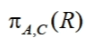
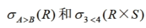
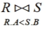
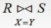
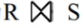
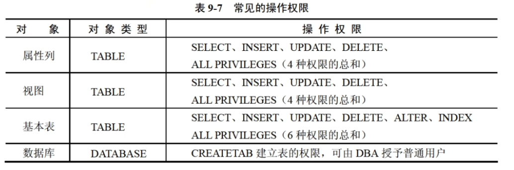

## 数据库

### 数据模型

- 数据模型：实体类型及实体类型间联系的模型
- 数据模型分类
  - 概念数据模型
    - 实体
    - 属性 (.attribute)
    - 码（唯一标识实体的属性）
    - 域（属性的取值范围，options）
    - 实体型 （具有相同属性的实体，=实体名+属性名）
    - 实体集 （同型实体的集合）
    - 联系 实体之间的对应关系（E-R）
      - 实体-矩形
      - 属性-椭圆形
      - 联系-棱形
  - 结构数据模型（直接面向数据库的逻辑结构）
    - 任何一个DBMS（数据库管理系统）都以某个结构数据模型为基础。
    - 主要包括：层次（树结构）、网状（图结构）、关系（二维表格）、面向对象模型

### 三级模式结构、两级映像

- 外模式（视图） + 模式（基本表） + 内模式（存储文件）
  - 外模式是**用户和数据库系统**的接口
  - 概念模式反映数据库结构及其联系
  - 内模式是数据**物理结构和存储方式**的描述
- 两级映像保证了数据库中的数据具有较高的逻辑独立性和物理独立性
- 模式-内模式映像（**物理独立性**）、外模式-模式映像（**逻辑独立性**）。

### 关系模型

- 术语

  - 关系：对应一张**二维表**
  - 元组：表中一**行**，对应一个记录值
  - 属性：表中一**列** 对应字段
  - 域：属性的取值范围
  - 关系模式：对关系的描述 格式为`关系名(属性1，属性2，...，属性名n)` 
  - 候选码：属性或属性组合，能**唯一标识**一个元组
  - 主码：候选码中选一个作为主码
  - 主属性：包含在任何**候选码中属性**，不包含的是非主属性
  - 外码：一个关系的属性是**另一个关系**的码
  - 全码：关系模式的**所有**属性组是该关系的候选码
  - 超码：一个包含码的**属性集**称为超码

- 定义：`R(U, D, dom, F)`

  - R为关系名
  - U为该系的属性名集合
  - D为属性组U中属性所来自的域
  - dom为属性向域的映像集合
  - F为属性见数据的依赖关系集合

- 组成：关系数据结构+关系操作集合+关系完整性约束

  - 关系数据结构：一张二维表格
  - 关系操作集合：选择、投影等...
  - 完整性约束：实体完整性 + 参照完整性 + 用户定义的完整性
    - 实体完整性：主属性不为空（能够被唯一标识）
    - 参照完整性：外码能在对应表中被找到（外码能找到）
    - 用户定义的完整性：用户对某一数据指定约束条件进行校验。（用户自定义校验）

- 集合运算符

  - 笛卡尔积 x

    > D1 = \{ 0, 1 \}
    >
    > D2 = \{ a, b, c \}
    >
    > D1 x D2 = \{ (0, a), (0, b), (0, c), (1, a), (1, b), (1, c) \}
  - 并 ∪
  
    - `R ∪ S` 所有元组合并，**删除重复元组**
  - 差 `-`
  
    - `R - S` 属于R 不属于S的所有元组
  - 交 `∩`
  
    - `R ∩ S` 既属于R又属于S的元组集合
  
- 关系运算符

  - 投影 `π`

    - 关系的**垂直**方向进行运算，选择若干属性组成新的关系
  
      
  
  - 选择 `σ`
  
    - 关系的**水平**方向进行运算，选择满足给定条件的元组
  
      
  
  - 连接`⋈`
  
    - `θ`连接：从R与S的笛卡尔积中选取属性间满足一定条件的元组。
  
      
  
    - 等值连接：当θ为`=`时
  
      
  
    - 自然连接：**除去重复属性**的等值连接。
  
      - 计算`R x S`
      - 根据等值条件筛选**公共属性相同**的元组
      - 去除相同的列（公共属性）
  
      
  
    - 外连接：是对连接运算的扩展，处理由于连接运算缺失的信息
      - 左外连接`⟕` ，以运算符左侧为准，自然连接后用null填充来自右侧关系的属性
      - 右连接`⟖`，同上，以右侧运算符为准
      - 全外连接`⟗`，既做左连接，也做右连接，合并结果
  
    > 其实自然连接达到的目的是 根据A表进行B表的关联查询 ，但是由于只做等值查询，舍弃了A表中没有关联B表的其他数据。
    >
    > 左连接解决该问题，将未关联的元组属性填写为null
    >
    > 右连接反之，以右侧为主
  
  - 除 `÷`

### 运算符转SQL

- 投影 选择

  - 投影 **select** 不支持列序号

  - 选择 **where** 

    ```sql
    select A,B,C from R where B >= 5
    ```

- 笛卡尔积 `R, S`

- 自然连接

  - 对于`R(A, B, C)` `S(B, C, D)`来说， `R⋈S`的SQL如下

  ```sql
  select R.A, R.B, R.C, S.D from R, S where R.B = S.B and R.C = S.C
  ```

### SQL语言

#### 数据定义语言

- 建立数据库 `CREATE DATABASE`
- 建立基本表 `CREATE TABLE 表名 (列名1 数据类型1 [列级完整性约束条件], 列名2 数据类型2, ...[表级完整性])`
- 修改表结构
  - 增加列 `ALTER TABLE 表名 ADD 列名 类型`
  - 修改列 `ALTER TABLE 表名 ALTER COLUMN 列名 新类型`
  - 删除列 `ALTER TABLE 表名 DROP COLUMN 列名`
- 删除表 `DROP TABLE 表名`

- 列级完整性约束条件

  - `not null` 不为空
  - `unique` 唯一，不允许重名
  - `not null unique` 不为空且唯一
  - `default` 默认值

  ```sql
  create table zst
  (
  	a int not null,
    b int unique,
    c int not null unique,
    d char(3) default 'zst'
  )
  ```

- 表级完整性约束条件

  - `PRIMARY KEY` 主键
  - `FOREIGN KEY` 连接到外键，选值只能参照外表的值范围
  - `CHECK` 检查，写逻辑自定义

  ```sql
  create table S
  (
  	refme int
  )
  
  create table R
  (
  	a int,
    b int,
    c int,
    primary key(a), -- a作为主键， 可以填多个
    foreign key(b) references S(refme), -- b外键 关联到S.refme，refme必须是unique唯一的
    check (c >= 0 and c <= 100) -- c范围为0 - 100
  )
  ```

  #### 数据操纵语言

  - 插入

    ```sql
    -- 直接插入数据
    insert into 表名 (列名序列) values (元组值)
    insert into student values(1, 2, 3)
    insert into student(学号) values (1)
    
    -- 插入查询结果值
    insert into 表名 (列名序列) select 查询语句
    ```

  - 删除

    ```sql
    delete from 表名 [where 条件表达式]
    delete from student where 学号 = '1'
    ```

  - 修改

    ```sql
    update 表名 set 列名=值表达式[,列名=值表达式...] [where 条件表达式]
    update student set 学号='2' where 班号='5班'
    ```

#### 数据查询语言

```sql
select 选择列名 （从表中提取列的数据）
from 表名 
where 行条件表达式
group by 分组 列名序列
having 组条件表达式
order by 列名
```

- 投影查询 `select`

  - 去除重复行可使用`DISTINCT`关键字

  ```sql
  select distinct 学号 from student
  ```

  - 用`as`关键字修改列名别名

  ```sql
  select 学号 as sno from student
  ```

- 选择查询`where`

  - 比较运算`between ... and ...`

  ```sql
  select * from score where 分数 between 60 and 80
  ```

  - 模糊匹配`[not] like`

    通配符`%`代表**任意长度（含0）字符串**，`_`代表任意**单个字符**

  ```sql
  select * from student where 姓名 like '王%'
  select * from student where 姓名 not like '王_'
  ```

  - 集合比较运算`[not] in`

  ```sql
  select * from score where 分数 in (85, 86, 87)
  ```

  - 逻辑组合运算

    用`and` `or`拼接以上查询

- 排序 `order by`

  `order by`必须是`select`的最后一个子句

  `asc`升，`desc`降

  ```sql
  -- 升序
  select * from student order by 班号 asc
  -- 降序
  select * from student order by 班号 desc
  -- 多字段排序，先以班号升序，相同的再按照分数降序
  select * from student order by 班号 asc, 分数 desc
  ```

- 聚合函数
  - 聚合函数实现数据统计功能，对一组值计算返回单一值
  - 平均值`AVG`

    ```sql
    select AVG(分数) from score
    ```

  - 选择的项数 `COUNT`

    ```sql
    select COUNT(分数) from score
    ```

  - 最小值 `MIN`

    ```sql
    select MIN(分数) from score
    ```

  - 最大值 `MAX`

    ```sql
    select MAX(分数) from score
    ```

  - 总和 `SUM`

    ```sql
    select SUM(分数) from score
    ```

- 数据分组`group by`

  - `select`将满足`where`条件的记录**按照指定列**分成集合组
  - 和聚合函数一起用时，先分组，再分别进行聚合运算
  - `having`子句筛选执行聚合后满足条件的组
  - 执行顺序
    - 执行`where`
    - `group by`进行分组
    - 聚合函数
    - `having`筛选符合条件的分组

- 表的连接查询

  - 内连接 `INNER JOIN`

    ```sql
    select * from student inner join score on student.`学号` = score.`学号`
    ```

    - 等值连接（值相等方式连接表）

      ```sql
      -- 查询09033班各科的课程平均分
      -- 这里使用了表的别名
      select y.课程号, AVG(y.分数) as '平均分'
      from student x, score y
      where x.学号=y.学号 and x.班号='09033' and y.分数 is not null
      group by y.课程号
      ```

    - 非等值连接（其它方式连接表）

      ```sql
      select 学号,课程号,等级
      from score, grade
      where 分数 between low and upp
      order by 等级
      ```

    - 自连接（同表中某行和另一行连接起来）

      ```sql
      -- 查询3-105课程成绩高于109号学生的所有学生记录
      select x.课程号,x.学号,x.分数
      from score x, score y
      where x.课程号='3-105' and y.课程号 = '3-105' and y.学号='109' and x.分数>y.分数
      order by x.分数 desc
      ```

      

  - 外连接 `OUTER JOIN`

    - 左外连接

      ```sql
      select course.课程名, teacher.姓名
      from course left join teacher on (course.教师编号=teacher.教师编号)
      ```

    - 右外连接

      ```sql
      select course.课程名, teacher.姓名
      from course right join teacher on (course.教师编号=teacher.教师编号)
      ```

    - 全外连接

      ```sql
      select course.课程名, teacher.姓名
      from course full join teacher on (course.教师编号=teacher.教师编号)
      ```

- 一般子查询（一个查询是另一个查询的条件）[内容用例较多 link](https://www.bilibili.com/video/BV1LZ4y1k7ma?vd_source=21261dee3bfaad5aaee4255297f7c2da&spm_id_from=333.788.player.switch&p=50)

  ```sql
  -- 课程号为305 且 分数比245最低分要高的数据，降序排列
  select * from score
  where 课程号='105' and 分数 > any(
  	select 分数 from score
    where 课程号='245'
  )
  order by 分数 desc
  ```

- 相关子查询（子查询依赖主查询）

  ```sql
  -- 成绩比该课程平均成绩高的学生成绩表
  -- 每次比较依赖当前课程号，通过当前课程号查询平均成绩
  select *
  from score a
  where 分数 > (
  	select avg(分数)
    from score b
    where a.课程号=b.课程号 and 分数 is not null
  )
  ```

- 查询结果的并 交 差

  ```sql
  select * from teacher
  union / intersect / except -- 并 交 差
  select * from student
  ```

#### SQL访问控制

- `GRANT` 授权

  ```sql
  grant <权限>[<权限>] on <对象类型><对象名> to <用户>[<用户>]
  
  -- s,p,j所有权限赋给user1, user2
  grant all privileges on table s,p,j to user1, user2
  
  -- s的插入权限赋值给user1，允许赋值给其他用户(with grant option)
  grant insert on table s to user1 with grant option
  
  -- 建表权限
  grant createtab on database db1 to user1
  ```

  

- `REVOKE` 收回权限，同上

  ```sql
  -- 收回所有用户对S的查询权限(public)
  revoke select on table s from public
  
  -- 收回user1对s表的sno列修改权限
  revoke update(sno) on table s from user1
  ```

### 视图

- 定义：从一个或者多个基本表或视图导出的表（**虚拟表**）

- 创建/删除

  ```sql
  create view 实体名
  as select 查询子句
  [with check option] -- 增删改式增加查询子句的条件表达式
  
  -- 例子
  create view student
  as selelct * from 学生表 where 专业='计算机'
  
  -- 删除
  drop view 视图名
  ```

- `with check option`作用是在增删改时，校验`where`子句规则

- 增删改视图时，基本表数据跟随变化（视图是基本表的映射）。

#### 索引


