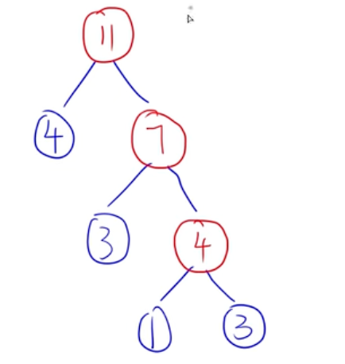

## 数据结构

### 复杂度

#### 大O表示法

#### 时间复杂度

算法执行时间随输入规模增长而变化的度量

#### 空间复杂度

空间随输入规模增长而变化的度量（输入数据不算空间）

#### 渐进符号（看不懂，后面再看）

> 分为三个界~~（这不华为么）~~
>
> 上界`O` 下界`Ω` 紧致界`θ`
>
> 例如，判断10n^2 + 4n + 2 = O(n^2)是否成立
>
> 则上界的括号里面需要大于等于表达式的复杂度
>
> 下界 需要 小于等于
>
> 紧致界 需要 等于

#### 递归时间、空间复杂度

- 时间复杂度：递归的次数 * 每次递归的时间复杂度

- 主观法（从[Spike8086](https://www.bilibili.com/video/BV15T411p7ja/?share_source=copy_web&vd_source=da06af369eda2d9e301dfbead2f13295)处学习）：

  

  这里的T(n/b)是和T(n)类似的函数！！

  常见题目是

  1. 计算空间复杂度。
     1. 符合上面公式的直接套。
     2. n^k对不上而且有㏒kn的，直接选有㏒k+1n的
  2. 两个算法比速度，求算式中某个值的最大值。
     1. 套到公式里，使得两个的值尽量靠近

### 线性结构

#### 线性表

- 顺序储存 ｜ 链式储存

**顺序存储**

- 使用地址连续的储存单元依次存储线性表
- 插入：先移动元素、再加入添加的元素。
  - 长度为n，期望为`n / 2`
  - 最好：`O(1)`
  - 最坏：`O(n)`
  - 平均（同上面期望）：`O(n)`
- 删除：先删除元素，再移动剩余元素。 
  - 长度为n，期望为`(n - 1) / 2`
  - 最好：`O(1)`
  - 最坏：`O(n)`
  - 平均（同上面期望）：`O(n)`
- 查找：`O(1)`

**链式存储**

- 通过指针链接起来的结点来存储数据元素。`[数据域, 指针域]`
- 插入：新`node.next`指向`prev.next`，`prev.next`再指向`node`
  - 最好：`O(1)`
  - 最坏：`O(n)`
  - 平均：`O(n)`
- 删除：`prev.next`指向`prev.next.next`
  - 最好：`O(1)`
  - 最坏：`O(n)`
  - 平均：`O(n)`
- 查找：循环查找`next`
  - 最好：`O(1)`
  - 最坏：`O(n)`
  - 平均：`O(n)`

**循环单链表**

- 可以从任何一个结点开始，遍历完整个数据结构。
- 尾结点：表的最后一个结点，尾部插入时可以直接用尾结点进行操作。

**双链表**

- `[数据域, 指针域（前、后）]`

#### 栈

- 只能访问数据结构的一端，先进后出、后进先出
- 栈的链式存储，只需要设置栈顶指针。入栈、出栈都不需要遍历链表。
- 常用于实现函数或过程的递归调用及返回处理时
- **做题时切记，给的元素可以单个进了就出，不是非要所有一起进！！**

#### 队列

- 先进先出的线性表，**插入端称为队尾，删除端称为队头**。
- 插入、删除后，之前的空间无法再利用，所以出现了循环队列，**尾指针是在最后的元素后面一个位置**。

- 队列链式存储（队头、队尾指针）
- 双端队列：两端都可以入或出（根据题目来定）

📒 从题中的总结

- 采用循环队列的优点是：入队出队操作都不需要移动队列中其他元素。（静态队列需要移动，避免之前用过的空间无法再使用）
- 两个栈可以模拟一个队列

#### 串

- 是特殊的线性表，仅由字符构成的有限序列。

**串的模式匹配**

- **模式串m**去**主串n**中进行匹配
- 朴素模式：一个一个去对比，去暴力对比。
  - 复杂度最好：`O(m)`
  - 最坏：`m * (n - m + 1) = O(n * m)`
  - 平均：`O(n + m)`
- `KMP`
  - 串的前缀：包含第一个字符且不含最后一个字符的子串
  - 串的后缀：包含最后一个字符且不含第一个字符的子串
  - 第`i`个字符的`next`值：从`1`到`i - 1`串中**最长相等前后缀**长度 + 1。其中，`next[1] = 0`
  - `KMP`算法
    - 主串`i`，模式串`j`，对比时`i`不回退
    - 当不匹配时，`j`回到`next`值，并和`i`进行比较

#### 数组

- 二维数组：`a[行号][列号]`

- 行存储：优先铺满行；列存储：优先铺满列

  

#### 矩阵（题目进行带入验证）

- 对称矩阵
  - 储存下三角区 + 对角线元素。
  - `a[i, j] = a[j, i]`
- 三对角矩阵
  - 主对角线附近的元素有值
- 稀疏矩阵
  - 非常多的0元素，将其储存为一维数组，每个元素包含`[行号, 列号, 值]`
  - 压缩存储方式为 **三元组顺序表** 和 **十字链表**

#### 树

- 非线性结构，一个数据元素可有0个或多个直接后继元素
- 概念：
  - 双亲：父结点
  - 结点的度：结点的**子树个数**
  - 叶子结点：度为0的结点
  - 内部结点：度不为0的结点
  - 结点的层次：字面意思。
  - 树的高度：一个树的最大层树为树的高度
- 性质：
  - 树中结点总数等于所有结点的度数之和加一（根结点）
  - 度为m的树中，第i层最多有mi-1个结点
  - 高度为h的m次树（度为m），最多有`(m ^ h - 1) / (m-1)`个结点
  - 具有n个结点，度为m的树的最小高度为`logm(n*(m-1) + 1)`

#### 二叉树

- 二叉树中结点的子树要区分左、右子树，即使只有一棵子树，也要指明是左还是右。
- 性质（大部分由上面树的性质推出）：
  - 对于任意一棵二叉树，度为0的结点数等于度为2的结点数+1
- 满二叉树：深度为k的二叉树有2k-1个结点。**有n层，则除了第n层全是度为2的结点，最满的情况！！**
- 完全二叉树：在满二叉树的基础上，最后一层可不满，但是都是从左往右排列。
  - 具有n个结点的完全二叉树的高度为Math.floor(log2n) + 1或Math.ceil(log2(n+1))

##### 存储结构

- 顺序存储（做题现画现推）

  - 中序遍历后依次存入，空结点也要存入。
  - 最坏情况下深度为`k`且只有`k`个结点的二叉树，需要2k-1个存储单元

- 链式存储

  - 二叉链表储存左右子结点的指针

  

📒 从题中的总结

- 完全二叉树更适合顺序存储，空结点少，利用率高
- 计算链表存储二叉树时，空指针记得计算根结点！！

##### 二叉树的遍历

- 先序遍历：**根** ➡️ 左 ➡️ 右
- 中序遍历：左 ➡️ **根** ➡️ 右
- 后序遍历：左 ➡️ 右 ➡️ **根**
- 层序遍历：从上往下，从左到右遍历
- **给出序列（一定有中序），反向构建二叉树**：
  - 先序：可以立刻确定第一个为根结点
  - 后序：可以立刻确定最后一个为根结点
  - 层序：第一个为根结点
  - 根据先、后去确定根结点，分左右后再次确定下面的根结点

##### 平衡二叉树

- 二叉树中任意一个结点的左右子树高度之差绝对值不超过1

##### 二叉排序树（左边小，右边大）

- 结点的值 大于左子树所有结点的值；小区右子树所有结点的值。
- 通过中序遍历得到的序列是有序序列
- 二叉排序树的构造：依次比较，小则作为左树，大则作为右树
- **效率最差**的二叉查找树是：单只树
- **从左到右排列同层次**的结点，其关键字呈现有序排列的特点

##### 最优二叉树（哈夫曼树）

- 加权路径长度最短的树。加权：`结点的值 * 到结点的路径`

- **构造哈夫曼树（给出权值）**：以**1 3 3 4**为例

  - 选出最小的两个值（1、3），以这两个作为子结点
  - 生成父结点，值为1+3=4，现在权值为 **4 3 4**
  - 同上，再选（4、3）作为子结点
  - 生成父结点4+3=7，现在权值为 **7 4**

  

- 构造规则：

  - 从前往后找权值最小
  - 小左大右
  - 相加后加入末尾
  - 权值相同，从前往后找

- 哈夫曼编码：先编码，再组树，再通过路径编码

- 哈夫曼编码压缩比
  - 先算等长编码：2^n >= 字符数
  - （等长 - 压缩） / 等长

📒 从题中的总结

- 哈夫曼编码方案基于 **贪心策略**
- 哈夫曼权重越大离根越近，权重越小离根越远

##### 线索二叉树

- 利用结点的空指针域来存放结点的前驱、后继信息。

#### 图

- 任意两个结点之间都可能有直接的关系。

##### 图的定义

- `G=(V,E)`，V是顶点的非空集合，E是图中边的有限集合

##### 有向图

- 图中每条边都是有方向的，顶点之间用`<vi,vj>`表示，`vi`为起点

##### 无向图

- 图中每条边都是无方向的，`<vi,vj>`和`vj,vi`是一样的

##### 完全图

- 每个点都连接了其他点。
- n个顶点的**无向完全图**共有`n * (n - 1) / 2`条边。
- n个顶点的**有向完全图**共有`n * (n - 1)`条边。

##### 度

- 顶点的度是关联于该顶点的边的数量，记作`D(v)`。
- 有向图的度 = 出度 + 入度

##### 路径

- 由边组成，由一个顶点到另一个顶点
- 第一个顶点和最后个顶点相同的路径称为 **回路或环**
- 简单路径：从一个顶点到另一个顶点，**所有顶点都不重复**。

##### 连通图、连通分量（针对无向图）

- 顶点A、B之间有**路径（不是一定要直连）**，称AB连通
- 图中**任意两个顶点都是连通的**，图为连通图
- n个顶点**最少**有n-1条边即可成为连通图

##### 强连通图、强连通分量（针对有向图）

- 同上，只是带了方向
- n个顶点**最少**有n条边即可成为连通图

#### 图的存储结构

##### 邻接矩阵表示法

- 对于n个顶点的图，邻接矩阵是个n阶方阵。其中`A[i][j]`表示`(vi,vj)`是边（用1、0表示）
- 无向图的邻接矩阵是对称的。

##### 邻接链表表示法

##### 稠密图、稀疏图

- 稠密图：边多，适合邻接矩阵
- 稀疏图：边少，适合邻接表

##### 图的遍历

- 深度优先搜索DFS（同树）
  - 矩阵复杂度`O(n ^ 2)`
  - 链表`O(n + e)`，n为顶点，e为边
- 广度优先搜索DFS（同树） **使用队列**
  - 矩阵复杂度`O(n ^ 2)`
  - 链表`O(n + e)`，n为顶点，e为边

📒 从题中的总结

- 图的深度优先遍历 **可以** 适用于无向图

#### 网

- 边或弧带权值的图

- 两个顶点无边，使用∞表示。

  

#### 拓扑排序

- AOV网，顶点表示活动，有向边表示活动之间优先关系。`优先➡️下一级`

- AOV是有向无环图，有环会有逻辑矛盾

- 拓扑排序

  

​	顶点`vi`在`vj`之前，可能存在`<vi, vj>`，一定不存在`<vj, vi>`的路径

### 查找

- 静态查找表
  - 查询**是否存在**
  - **检索**数据元素特性
  - **顺序查找、折半查找、分块查找**
- 动态查找表
  - 插入
  - 删除
  - **二叉排序树、平衡二叉树、B_树、哈希表**
- 关键字：标识数据元素。主关键字：唯一标识；次关键字：能标识多个数据元素（不唯一）

#### 顺序查找

- 从头开始依次比较，相同则为成功
- 长度为`n`，顺序查找成功的平均查找长度为：`(n + 1) / 2`，通过等比推导
- 既适用于顺序存储结构，也适用于链表结构

#### 折半查找（二分）

- 最多比较的次数：min(log2n) + 1
- 要求顺序存储，有序排列
- **做题注意题目是否已经指定取整方式**

#### 哈希表

- 哈希表通过计算一个以记录的关键字为自变量的函数，来得到该记录的存储地址。**通过值获取位置**

- 哈希的冲突是无法避免的

- 哈希函数的构造方法

  - 哈希函数应是一个压缩映像函数，应具有较大的压缩性，节省存储空间

  - 应具有较好的散列性，尽量避免冲突

  - 对关键字进行计算，尽可能使关键字所有组成部分都能起作用

  - 直接定址法、数学分析法、平方取中法、折叠法、随机数法、**除留余数法**

  - 解决冲突的方法：

    - 线性探测法：冲突后，+1直到不冲突
    - 二次探测：冲突后根据序列进行加减 `1,-1,4,-4,9,-9`
    - 链地址法

    

- 哈希表的查找

  - 查找过程中比较关键字的个数取决于 **哈希函数、处理冲突方法、哈希表装填因子**
  - 装填因子定义：**表中装入的记录树 / 哈希表的长度**
  - 装填因子越小，发生冲突可能性越小

### 堆

#### 小顶堆、大顶堆

- 可以用树表示，小顶堆：父小于子；大顶堆：父大于子

### 排序

- 排序稳定：对于两个相同的值，**排序后顺序依然一致**。

- 算法

  

#### 直接插入排序

- 每当新插入一个时，依次去做比较。打扑克的排序
- **适合于**基本有序的数组进行排列

#### 希尔排序

- 直接插入排序基础上优化，先分割为子序列，进行排序，最后进行总体排序

#### 计数排序

- 统计每个数的数量，再根据数量按照序列还原序列。
- **适用于**关键字数量少（例如只有0-9）的情况

#### 简单选择排序

- 先遍历找最小的值，放到第一个（默认第一个是最小，遍历完有更小的就交换）。再对后续的数组进行同样的处理。

#### 堆排序

- 每次排序都可以确定一个元素的最终位置
- 新建堆 ➡️ 初始化大/小根堆 ➡️ 层序遍历（有序的，递增/递减）

#### 冒泡排序

- 通过重复比较相邻元素并交换位置，将最大（或最小）元素逐步“冒泡”到数组末尾的简单排序算法
- 每一次循环都可以将最大/小值冒泡到最后，每次循环长度都在-1

#### 快速排序

- 步骤
  - 选基准：从数组中选一个元素作为基准（通常选第一个或最后一个）。
  - **分区**：将数组分为两部分，小于基准的放左边，大于基准的放右边。
  - 递归：对左右两部分递归执行上述步骤。
  - 合并：递归结束后，数组自然有序。
- **基本有序的序列是最坏的情况**

#### 归并排序

- 算法设计方法：分冶法

📒 从题中的总结

- 优先队列采用堆数据结构实现，堆的插入时间复杂度是`O(lg n)`