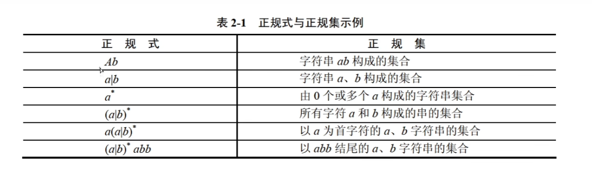

## 程序设计语言

### 编译程序和解释程序

- 称机器语言和汇编语言为低级语言
- 解释器：翻译源程序时不生成独立的目标程序，解释程序和源程序要参与到程序的运行过程中
- 编译器：编译时将源程序翻译成独立保存的目标程序，机器上运行的是和源程序等价的目标程序，源程序和翻译程序都不再参与目标程序的运行过程

### 程序设计语言基本成分

- 可计算问题的程序都可以使用**顺序、选择、循环**三种控制结构来描述
- **逻辑表达式的使用**

📒 从题中的总结

- 程序数据的类型作用**不**包括 便于定义动态数据结构
- 程序设计语言的基本成分包括数据、运算、控制和传输等
- 高级程序设计语言不依赖具体的机器硬件

### 传值调用与传引用调用

- 函数定义包括两部分，函数首部和函数体。

> 返回值的类型 函数名(心事==形式参数表) // 函数首部 函数名(实参表)
>
> {
>
> ​	函数体;
>
> }

- 值调用：函数调用时将实参的值传递给相应的形参，形参不能向实参传递信息
- 引用调用：当形式参数为引用类型时，函数中对形参的访问和修改实际上就是针对相应实参所做的访问和改变

### 编译、解释程序

- 编译过程：词法分析、语法分析、语义分析、中间代码生成（非必要）、代码优化（非必要）、目标代码生成
- 解释方法：词法分析、语法分析、语义分析
- **符号表**：不断收集、记录、使用源程序中一些相关符号的类型和特征等信息，并将其存入符号表中。记录源程序中各个字符的必要信息，以辅助语义的正确性检查和代码生成。
#### 词法分析
- 输入：源程序。输出：记号流
- 作用：分析构成程序的**字符及由字符**按照构造规则构成的符号是否符合程序语言的规定
#### 语法分析
- 输入：记号流。输出：语法树（分析树）
- 作用：对各条语句的**结构**进行合法性分析，分析程序语句的结构是否正确。**可发现所有语法错误**。
#### 语义分析
  - 输入：语法树
  - 进行**静态**类型分析和检查，可发现**静态语义错误**，动态语义错误（例如死循环）要在程序运行时才嫩检测出来
#### 目标代码生成
  - 目标代码生成阶段的工作与具体的机器密切相关，**寄存器的分配工作**处于目标代码生成阶段
#### 中间代码生成
  - 根据语义分析输出生成中间代码，与具体机器无关，有利于进行与机器无关的优化处理和提高编译程序的可移植性。
  - 常用实现方式：后缀式、三地址码、三元式、四元式、树（图）。
  - 中间代码可以跨平台

#### 正规式（以符号表示字符组合方式，类似于正则）

#### 有限自动机

- 是**词法分析**的一个工具，能够正确的识别正规集
- 确定的有限自动机（DFA）：对每一个状态来说识别字符后转移状态是唯一的
- 不确定的自动有限机（NFA）：对每个状态来说识别字符后转移的状态是不确定的
- 关于图的知识点
  - 两个圈为终态，终态也可以继续流转，如果最后不能到终态则说明字符不合规
  - ∈为空，可直接跳转

📒 从题中的总结

- 与编译器相比，解释器参与运行控制，程序执行速度慢
- 类型检查在语义分析阶段处理。

#### 上下文无关文法

- 大多数程序设计语言的语法规则用上下文无关文法描述
- 上下文无关文法由四个部分组成，通常表示为四元组 **G=(V,Σ,R,S)**，其中：
  - **V** 是一个非终结符（non-terminal symbols）的有限集合，也称为变量。
  - **Σ** 是一个终结符（terminal symbols）的有限集合，也称为字母表。
  - **R** 是一个产生式规则（production rules）的有限集合，每个规则的形式为A*→*α，其中 A*∈*V 是一个非终结符，而 α 是 (*V*∪Σ) 中的一个字符串，即可以包含非终结符和终结符的任意组合。
  - **S** 是一个特殊的非终结符，称为开始符号（start symbol），它属于 V。
- **产生式规则**定义了如何从非终结符生成终结符字符串
- 解析算法
  - **自顶向下解析**：从开始符号开始，尝试匹配输入字符串。常用的方法有递归下降解析法和预测分析法。
  - **自底向上解析**：从输入字符串开始，尝试构建语法树。常用的方法有LR解析法和移进-归约分析法。
- 考题除了概念都是对表达式或树的推导。用选项代入或者排除选项方式做题。

#### 中缀后缀表达式

- 中缀式：a+b  后缀式（逆波兰式） ab+
- 后缀式利用栈进行求值
- 语法树的后缀式为后序遍历、中缀式为中序遍历
- 后缀表达式计算方式（遇到操作符时，用扫描到的最新的两个操作数进行运算）
  - 从左至右扫描后缀表达式。
  - 如果遇到操作数，将其压入栈中。
  - 如果遇到操作符，从栈中弹出相应数量的操作数（通常是两个），执行该操作，并将结果压回栈中。
  - 当扫描完整个表达式后，栈顶元素即为表达式的值。

