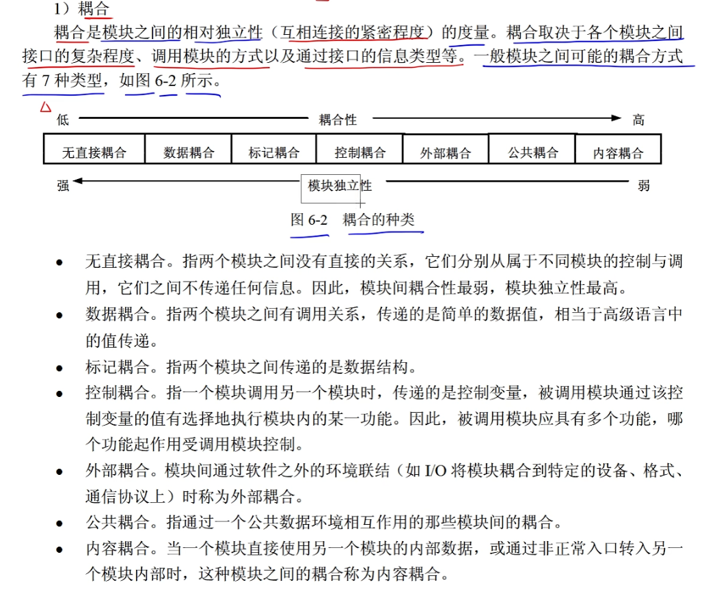
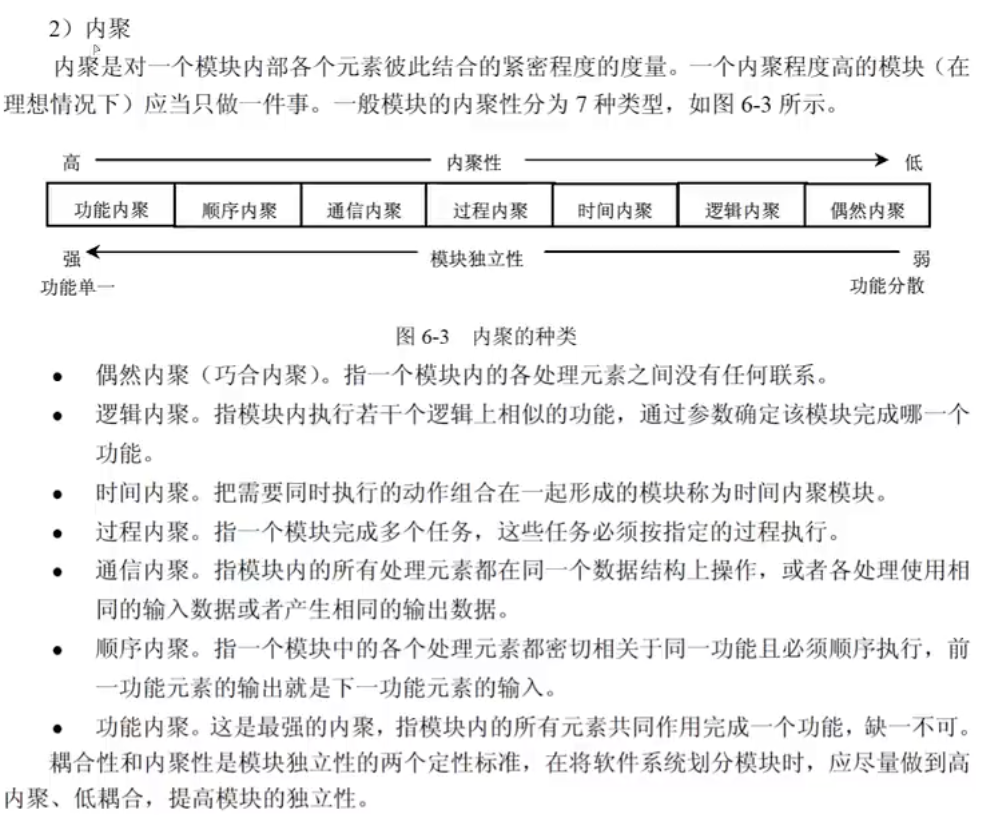
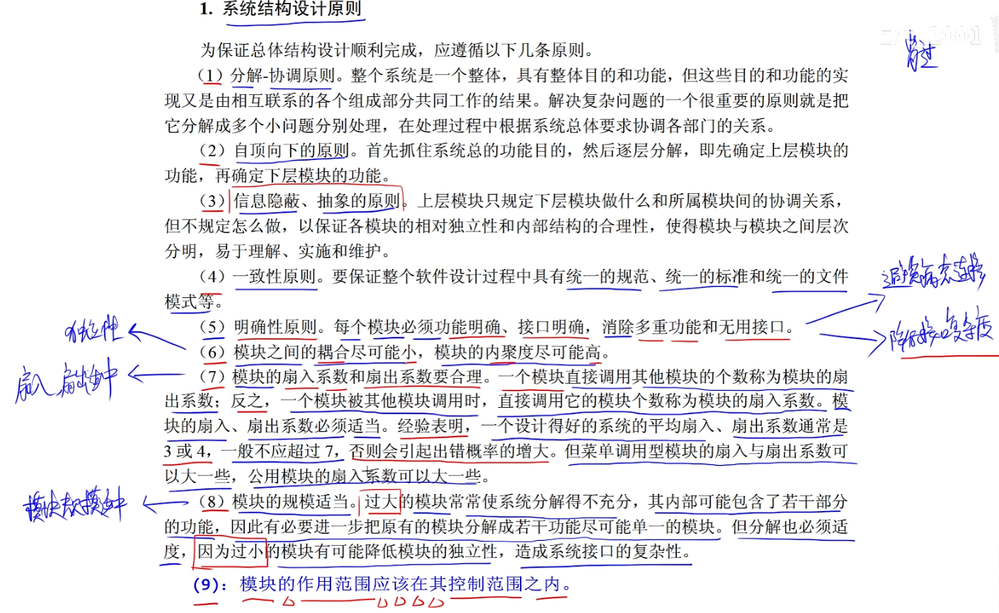

## 结构化开发

- 系统设计的基本原理
  - 抽象
  - 模块化
  - 信息隐蔽
  - 模块独立

### 耦合

重点是区分各种耦合、耦合强度

### 内聚

### 设计原则

### 系统文档

| 人员                       | 阶段               | 文档                                                         |
| -------------------------- | ------------------ | ------------------------------------------------------------ |
| 用户、系统分析人员         | 系统规划和系统分析 | 可行性研究报告、总体规划报告、系统开发合同和系统方案说明书   |
| 系统开发人员、项目管理人员 | 项目期             | 系统开发计划（包括工作任务分解表、PERT 图、甘特图和预算分配表等）、系统开发月报以及系统开发总结报告 |
| 系统测试人员、系统开发人员 |                    | 系统方案说明书、系统开发合同、系统设计说明书和测试计划       |
| 系统开发人员、用户         | 系统运行期间       | 用户手册和操作指南                                           |
| 系统开发人员、系统维护人员 |                    | 系统设计说明书和系统开发总结报告                             |
| 用户、维修人员             | 运行维护期间       | 系统运行报告和维护修改建议                                   |

### 数据流图

同下午试题1

- 数据流图描述 数据在系统中如何被传送或变换，以及如何对数据流进行变换的功能或子功能，用于对功能建模

### 数据字典

- 数据字典为数据流图中的每个数据流、文件、加工以及组成数据流或文件的数据项做出说明
- 数据字典的**内容**包含4类条目：数据流、数据项、数据存储、基本加工。数据项是组成数据流和数据存储的最小元素
  - 数据流条目：给出DFD中数据流的定义。
  - 数据存储条目：对数据存储的定义。
  - 数据项条目：不可再分解的数据单元。
  - 基本加工条目：基本加工的处理逻辑。
- 数据词典**管理**：词典管理把词典条目按照某种格式组织后存储在词典里，提供排序、查找统计功能。
- 加工逻辑，加工逻辑描述方法有3种
  - 结构化语言
    - 外层
      - 顺序结构
      - 选择结构 `IF-THEN-ELSE-ENDIF` `CASE-OF-ENDCASE`
      - 重复结构 `DO-WHILE-ENDDO` `REPEAT-UNTIL`
    - 内层
  - 判定表（决策表）
  - 判定树

📒 从题中的总结

- 基本加工
  - 对于每一个基本加工，必须有一个加工规格说明
  - 加工规格说明必须描述把输入数据流变换为输出数据流的加工规则
  - 加工规格说明不需描述实现加工的具体流程
- 结构化分析方法中，数据流图中的元素在**数据字典**中进行定义

📒 杂题总结

- 一个软件系统不仅仅只有一种数据流类型
- 结构化开发方法中，**过程设计**主要包含对数据结构和算法的设计。
- 数据流图建模应遵循 **自顶向下、从抽象到具体** 的原则

