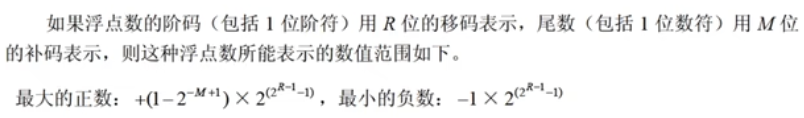
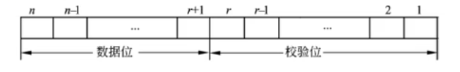
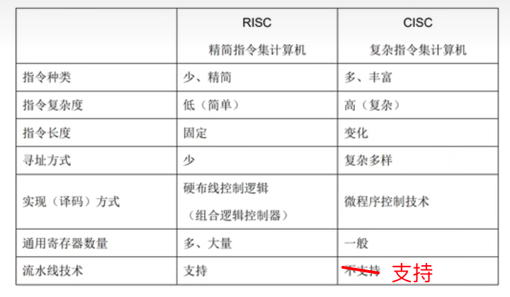

## 计算机系统

### 中央处理单元

- CPU的功能

  - **运算器**：数据处理
    - ALU 算数逻辑单元 算数+逻辑
    - AC 累加寄存器 为ALU提供工作区 运算器中至少有一个AC
    - DR 数据缓冲寄存器 中转站
    - PSW 状态条件寄存器 
  - **控制器**：控制整个CPU的工作。程序执行、操作控制、时间控制 。**保证程序正常执行，处理异常事件**
    - IR 指令寄存器 **暂存指令** 指令译码器根据IR内容产生操作指令
    - PC 程序计数器 **储存程序执行指令的地址** 顺序：pc = pc + 1 。
    - AR 地址寄存器 保存当前CPU所访问的内存单元地址
    - ID 指令译码器 指令 = 操作码 + 地址码 对操作码字段进行分析解释

  📒 从题中的总结

  - 执行指令： 内存 -> DR -> IR 。在这之前，从PC取指令
  - AC为ALU执行运算时**提供数据**并**暂存运算结果**
  - 控制器决定了计算机运行过程的自动化
  - 指令寄存器对用户是完全透明的（无法访问，无感知）

### 计算机基本单位

- 单位
  - 最小的数据单位 b。最小的储存单位 byte

|      |      |      |      |
| ---- | ---- | ---- | ---- |
| 位（比特） | bit  | b    |      |
| 字节       | byte | B    | 8    |
| 千字节     |      | KB   | 1024 |
| 兆字节     |      | MB   | 1024 |
| 吉字节     |      | GB   | 1024 |
| 太字节     |      | TB   | 1024 |

- 进制

#### 整数数据表示

- 各种数值在计算机中的表示形式称为机器数，二进制计数

- 带符号的机器数可用原码、反码、补码进行编码

- 原码：最高位符号位，0正1负

- 反码：最高位符号位，0正1负。正数的原码和反码相同，**负数反码是绝对值按位取反**

- 补码：最高位符号位，0正1负。正数的补码同原、反，负数的补码等于反码末位+1

- 移码：补码基础上，符号位取反

- x[补]\[补] = x[原]

- 表示范围

  

- ±0编码相同的是 移码和补码

- 常采用补码表示运算数据，**原因是补码可以简化计算机运算部件设计**（把减法当加法运算，减去一个数=加它的补码）

#### 浮点数表示

- **N = 2E * F**           E：阶码，为整数  F：尾数，为带符号的纯小数

- 浮点数表示格式：阶符 + 阶码 + 数符 + 尾数

- 浮点数能表示的**数值范围**由**阶码**决定，数值精度由**尾数**决定

- 规格化浮点数：将尾数的绝对值限定在**[0.5, 1]**

- 范围结论：

  

  > 推导：
  > 已知 阶码E为整数，尾数F为小数
  > 最大的正数：E为最大，F为最大
  > 最小的负数：E最大，F为最小
  > 参考[表1-1](#表1-1)可得出结论

📒 从题中的总结

- 工业标准IEEE754浮点数格式中阶码采用移码、尾数采用原码表示
- 在总位数相同的情况下，浮点表示法相对于定点表示法可以表示更大的数
-  对阶：将小阶向大阶对齐，尾数向右移

#### 寻址

- 立即寻址 操作数在指令中
- 直接寻址 操作数在内存单元 指令给出储存单元的地址
- 寄存器寻址 操作数在寄存器 指令给出寄存器名
- 寄存器间接寻址 操作数在内存单元 内存单元地址在寄存器中
- 间接寻址 指令中给出操作数地址的地址（指针）
- 相对寻址 指令地址码给出偏移量，操作数地址=本条指令地址+偏移量
- 变址寻址 操作数地址等于变址寄存器内容+偏移量

📒 从题中的总结

- 采用不同寻址方式的目的：扩大寻址空间并提高编程灵活性

#### 校验码

- **奇偶检验码** 增加**一位**校验位，使编码中1的个数为奇数（奇校验）或偶数（偶校验） **码距为2**

- 奇偶检验码分为三种：水平奇偶检验码、垂直奇偶检验码、水平垂直奇偶检验码

- **码距** 编码系统中任意两个合法编码至少有多少个二进制位不同，码距=2时具有检错能力，码距≥3时，可能有纠错能力

- **海明码** 在数据位之间的特定位置插入k个校验码，通过**扩大码距**实现**检错和纠错**。数据位n位，校验位k位，n和k必须满足以下关系

  **2k - 1 ≥ n + k**

- **CRC循环冗余校验码** 利用**生成多项式**为k个数据位生成r个校验位进行编码 采用**模2运算**

  

📒 从题中的总结

- 海明码利用多组数位的奇偶性来检错和纠错

#### RISC CISC

📒 从题中的总结

- 采用CISC技术的CPU，芯片设计复杂度更高
- RISC编译器的子程序库通常比CISC编译器的子程序库大得多
- RISC比CISC更适合VLSI工艺的规整性要求
- RISC增加寄存器数目以减少访问次数
- RISC用硬布线电路实现指令解码，快速完成指令译码

#### 指令流水线

- 流水线时间 = 一条指令执行时间 + ( n - 1 ) * 操作周期
- 加速比 = 不采用流水线时间 / 采用流水线时间
- 操作周期：一个指令中的最长时间段
- 吞吐率：1 / 操作周期
- 执行n条指令的吞吐率：n / 流水线时间

📒 从题中的总结

- 如果流水线出现断流（不是持续的输入，有断开），加速比会下降
- 要使加速比和效率最大化应该对流水线各级采用相同运行时间
- 流水线采用异步控制不会明显提高其性能

#### 存储器

- 按照所处位置分类：内存（主存）、外存（辅存）。主存储器 DRAM **周期性刷新**
- 构成材料分类：磁存储器、半导体存储器、光存储器
- 工作方式分类：
  - RAM 读/写存储器
  - ROM 只读存储器（固定只读存储器 厂家写入、可编程只读存储器 用户可一次性写入）
  - EPROM 可擦除可编程的只读存储器
  - EEPROM 电擦除可编程只读存储器
  - 闪速存储器 闪存 以块为单位 特性介于EPROM EEPROM之间
- 按访问方式：按地址访问、按内容访问（相联存储器）
- 按寻址方式分类：
  - RAM 随机存储器
  - SAM 顺序存储器 例如磁带
  - DAM 直接存储器 例如磁盘
- 虚拟存储器由主存和辅存组成

- 空间局部性：一个内存位置引用了一次，不远的将来引用其附近的一个储存位置
- 时间局部性：一个内存位置引用了一次，不远的将来再被多次引用

📒 从题中的总结

- 闪存
  - 掉电后信息不会丢失，属于非易失性存储器
  - 以块为单位进行删除操作
  - 在嵌入式系统中可以用Flash代替ROM

#### 高速缓存Cache

- 位于CPU与主存储器之间，速度比主存快5-10倍
- 拷贝主存的副本，CPU先找Cache，未命中再找主存
- 主存如何映射到缓存，**这个过程是由硬件自动完成的**：
  - 直接映像，对应关系固定 **冲突大**
  - 全相联映像，主存任一块可调入Cache储存器的任何一个块中 **冲突小**
  - 组相联，介于两者之间 **冲突适中**
- 替换算法：
  -  随机替换算法
  - 先进先出算法
  - 最近最少使用算法
  - 优化替换算法 先执行一次程序，统计Cache替换情况，第二次该程序时可用最有效的方式替换

📒 从题中的总结

- Cache设计思想是在合理成本下提高命中率

#### 中断

- 把所有**中断服务程序的入口地址**（中断向量）汇集为中断向量表
- **中断响应时间**：发出中断请求--进入中断服务程序
- 为了便于实现多级中断嵌套，使用**堆栈**来保护断电和现场最有效

#### 输入输出（I/O）

控制方式：

- 程序查询方式
  - CPU和外设只能串行工作，CPU一直轮训检查，**利用率低**
  - 一次只能读/写一个字
  - CPU将数据放入内存
- 中断驱动方式
  - I/O设备通过中断信号主动报告I/O操作完成
  - CPU和I/O可并行工作，CPU利用率得到提升
  - 一次只能读/写一个字
  - CPU将数据放入内存
- 直接储存器方式 DMA
  - CPU和I/O并行工作 仅在传送数据块开始和结束时才需要CPU干预
  - 一次读写的单位为‘块’，不是字
  - 由外设直接将数据放入内次呢

📒 从题中的总结

- CPU是在一个**总线周期**结束时响应DMA请求的
- 采用DMA传送数据时，每传送一个数据都需要占用一个存储周期

#### 总线 （内容过多，后续有空看文档⁉️

- 分类：数据总线、地址总线、控制总线

📒 从题中的总结

- 字长N位 -> 数据总线宽度为N位
- 内存容量X B -> 内存单元的地址（地址总线）宽度X位
- 总线结构可减少信息传输线的数量
- SCSI是外部总线的一种，不是系统总线
- PCI是并行内总线，SCSI是并行外总线

#### 加密技术与认证技术

- 问题与解决方式
  - 窃听-加密；篡改-摘要；假冒、否认-数字签名
- 加密
  - 对称加密：加密解密速度快
  - 非对称加密：用公钥加密则只能用私钥解密，私钥加密则只能用公钥解密
  - 混合加密
- 摘要：Hash算法后得到摘要，对比摘要判断是否和原文一致
- 数字签名：发送方用自己**私钥签名**，得到的数字签名放在密文一起发送；接收方**公钥验证**，成功则无法被假冒且不能否认
- 数字证书：用户向CA申请数字证书，将个人信息和公钥发给CA机构，数字证书用CA的私钥进行加密。

📒 从题中的总结

- 私钥解密和签名，公钥加密和验证
- 用户通过CA的公钥验证数字证书真实性（说明是CA颁发的）
- PKI体制中，保证证书不被篡改的方法是：使用CA的私钥对证书进行签名
- 认证阻止主动攻击，加密阻止被动攻击

#### 加密算法

- 对称加密算法：DES、3DES、RC-5、IDEA、AES（分组加密）、RC4
- 非对称加密算法：RSA、ECC、DSA
- Hash函数
- MD5摘要算法，输出结果为128位
- SHA-1安全散列算法

#### 可靠性（公式

