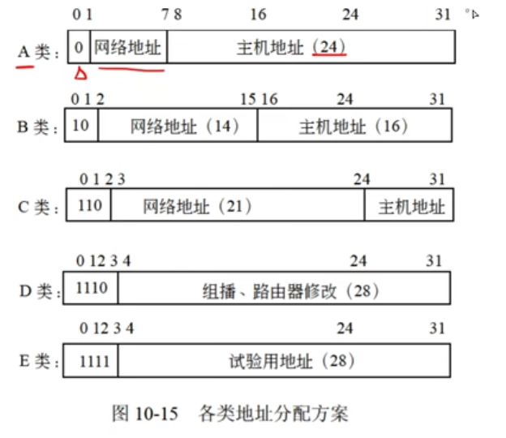
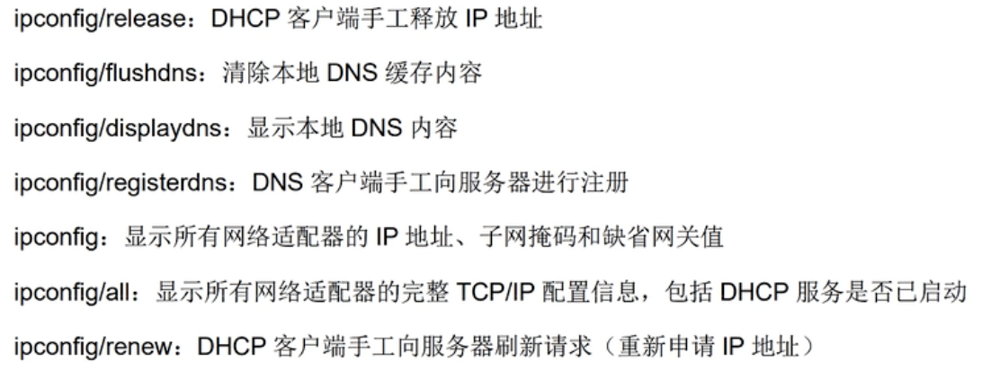

## 计算机网络

### 网络设备

- 物理层
  - 中继器：物理层实现局域网网段互联
  - 集线器：特殊的多路中继器
- 数据链路层
  - 网桥：用于连接两个局域网网段
  - 交换机：多端口的网桥
- 网络层
  - 路由器：连接多个逻辑上分开的网络
- 应用层
  - 网关

| 能否隔离   | 广播域 | 冲突域 |
| ---------- | ------ | ------ |
| 物理层     | ❌      | ❌      |
| 数据链路层 | ❌      | ✅      |
| 网络层     | ✅      | ✅      |

### 协议簇

- `ICMP`协议数据单元封装在IP数据报中传送

### 网际层协议

**IP**

- IP只提供无连接、不可靠的服务。将上层数据（TCP、UDP）或同层其他数据（ICMP）封装到IP数据报中。

**TCP（传输控制协议）**

- 可靠传输、连接管理、差错校验和重传、流量控制、拥塞控制、端口寻址。
- 流量控制采用 **可变大小的滑动窗口协议**
- 主机间建立和关闭连接操作时，均需要通过**三次握手**来确认建立和关闭是否成功。

**UDP（用户数据报协议）**

- 是一种不可靠、无连接的协议，开销更小
- 错误检测功能更弱，传输速率更高。

📒 从题中的总结

- TCP、UDP均有**端口寻址**的能力

### 电子邮件服务

- `E-mail`系统基于 C/S 模式
- 【发】`SMTP（简单邮件传输协议）`只能传输ascii和文本性附件。可通过`MIME`扩展，`PEM`是增强私密邮件保护协议
- 【收】`POP3`即可和`SMTP`共用，也可单独使用。`POP3`是一种简单纯文本协议，每次以整个邮件传输，不能部分传输。
- `SMTP`端口25，`POP3` 端口110。都是利用TCP。

### ARP（解析地址）和RARP（反解析）

- ARP是将IP地址转换为mac地址，RARP反之
- 计算机与其他计算机通信时，需要ip->mac转换，查询形式：`ARP高速缓存`➡️`广播形式发送ARP请求包`➡️`ip相同应答计算机生成ARP应答信息，包含mac地址`➡️`将该ip、mac添加到高速缓存`➡️`开始通信`

### DHCP（动态主机配置协议）

- 集中管理、分配IP地址，使主机能动态获得ip、Gateway、dns服务器等，提升地址使用率
- DHCP客户端可以从DHCP服务器获得本机IP、DNS、DHCP服务器地址、默认网关地址
- windows无效地址：`169.254.x.x`；Linux：`0.0.0.0`

### URL

- `协议名://主机名.域名.域名后缀.域名分类/目录/网页文件`

### 浏览器

- **客户端**域名查IP：`本地hosts`➡️`本地DNS缓存`➡️`本地DNS服务器`➡️`根域名服务器`
- **域名服务器**域名查IP：`本地缓存`➡️`本地hosts`➡️`本地数据库`➡️`转发域名服务器`

### Internet地址

#### 域名（内容同URL、浏览器）

#### IP地址

- 主机地址用IP地址来标识，因为Internet网络协议是TCP、IP

- IP地址中全0是网络，全1是广播。**主机地址不可全为0/1**

  

  - 全部地址的数量计算：`(2^网络地址位数 - 2) * (2^主机地址位数 - 2)`
  - C类是**最通用**的Internet地址
  - D类用于组播，例如路由器修改。
  - E类地址为实验保留

- 子网掩码：用于识别报文是仅存放在网络内部还是被路由转发到其他地方

  > 子网掩码是一个32位的二进制数，与IP地址进行“与”运算，可以提取出网络地址。
  >
  > 1 表示网络部分，0 表示主机部分
  >
  > A：255.0.0.0
  >
  > B：255.255.0.0
  >
  > C：255.255.255.0

📒 从题中的总结

- **被划分了几个子网？**在某类网络本身基础上扩展了几位（通过子网掩码计算）
- 222.125.80.138/26，其中26是指子网掩码长度为26位。
- **汇聚成超网**：和子网反向，把网络地址往前推；子网是往后加
- **是否属于同一子网**，子网掩码位数n，判断设备地址的前n位是否相等（网络地址是否相同）。
- **路由表是否匹配**，同子网判断

### IPV6

- IPV6是128位

### 无线网络

- 蓝牙：覆盖范围小、通信距离短

### Windows命令

- ping命令检测顺序：`127.0.0.1`➡️`本地IP`➡️`默认网关`➡️`远程主机`
- netstat功能：显示网络连接、路由表、网络接口信息。

### 路由

- 