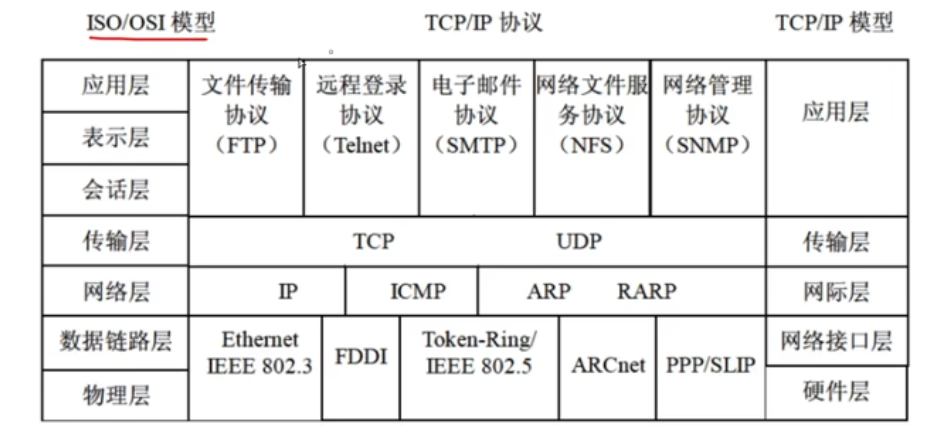
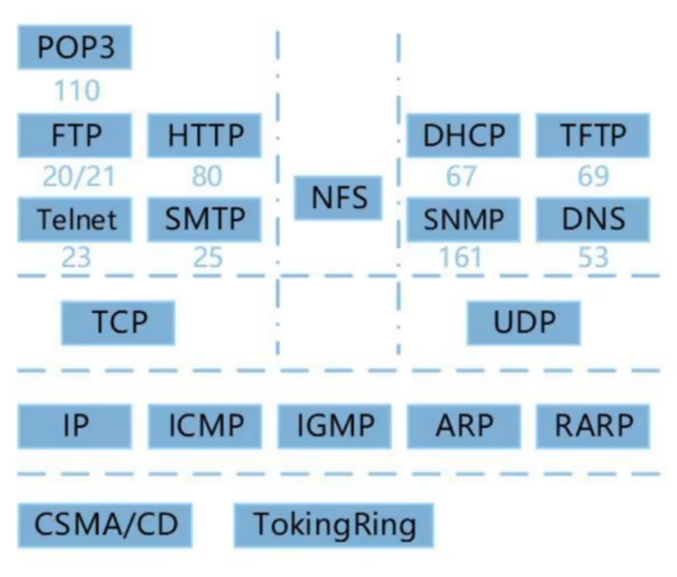

## 计算机网络

### 网络设备

- 物理层
  - 中继器：物理层实现局域网网段互联
  - 集线器：特殊的多路中继器
- 数据链路层
  - 网桥：用于连接两个局域网网段
  - 交换机：多端口的网桥
- 网络层
  - 路由器：连接多个逻辑上分开的网络
- 应用层
  - 网关

| 能否隔离   | 广播域 | 冲突域 |
| ---------- | ------ | ------ |
| 物理层     | ❌      | ❌      |
| 数据链路层 | ❌      | ✅      |
| 网络层     | ✅      | ✅      |

### 协议簇

- `ICMP`协议数据单元封装在IP数据报中传送

### 网际层协议

**IP**

- IP只提供无连接、不可靠的服务。将上层数据（TCP、UDP）或同层其他数据（ICMP）封装到IP数据报中。

**TCP（传输控制协议）**

- 可靠传输、连接管理、差错校验和重传、流量控制、拥塞控制、端口寻址。
- 流量控制采用 **可变大小的滑动窗口协议**
- 主机间建立和关闭连接操作时，均需要通过**三次握手**来确认建立和关闭是否成功。

**UDP（用户数据报协议）**

- 是一种不可靠、无连接的协议，开销更小
- 错误检测功能更弱，传输速率更高。

📒 从题中的总结

- TCP、UDP均有**端口寻址**的能力

### 电子邮件服务

- `E-mail`系统基于 C/S 模式
- 【发】`SMTP（简单邮件传输协议）`只能传输ascii和文本性附件。可通过`MIME`扩展，`PEM`是增强私密邮件保护协议
- 【收】`POP3`即可和`SMTP`共用，也可单独使用。`POP3`是一种简单纯文本协议，每次以整个邮件传输，不能部分传输。
- `SMTP`端口25，`POP3` 端口110。都是利用TCP。

