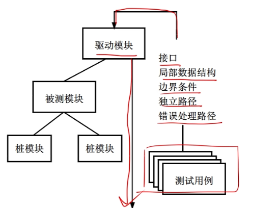
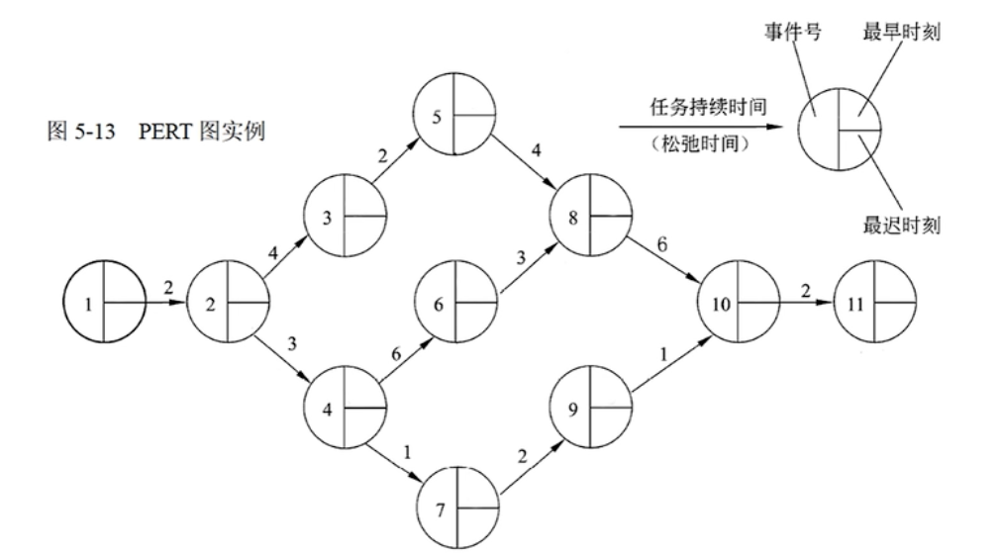
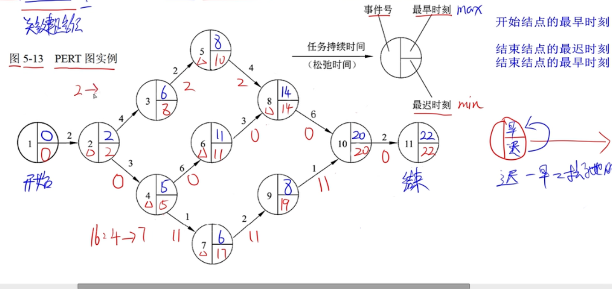
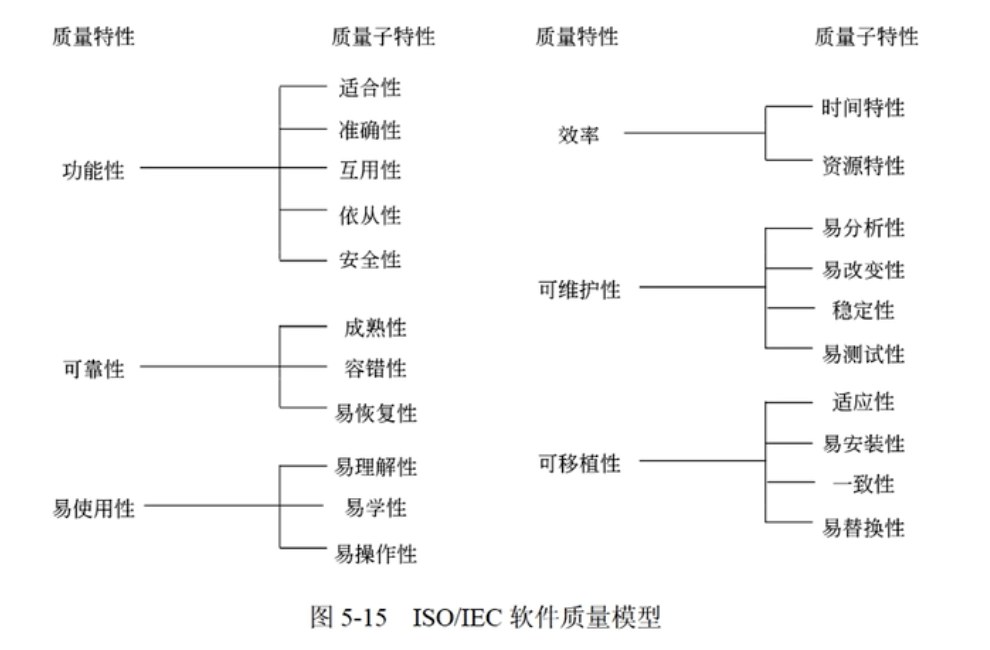
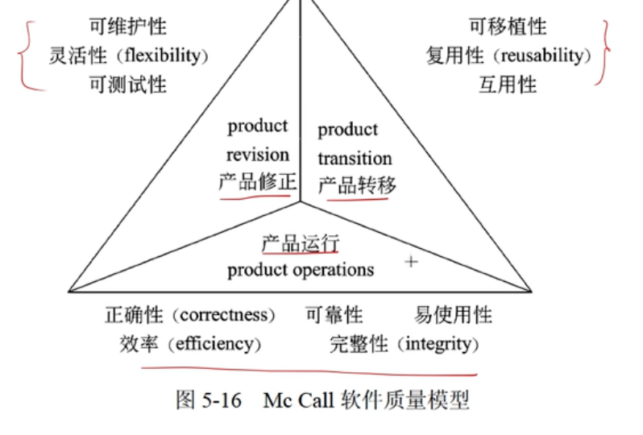

## 软件工程

### 能力成熟度模型 CMM

**5个成熟度等级**

- 初始级
  - 杂乱无章，几乎没有明确定义的步骤，依赖于个人的努力
- 可重复级（基本）
  - 建立了**基本的项目管理过程和实践**来追踪项目费用、进度和功能特性，**有必要的过程准则**来重复以前在同类项目中的成功
- 已定义级（标准）
  - 管理和工程两方面的软件过程已经**文档化、标准化**，并综合成整个软件开发组织的**标准软件过程**。所有项目都采用根据实际情况修改后得到的标准软件过程来开发和维护软件。
- 已管理级（主动应对、质量）
  - 制定了**软件过程和产品质量的详细度量标准**。软件过程的产品质量**都被开发组织的成员所理解控制**。
- 优化级（连续改进）
  - 加强了定量分析，通过来自**过程质量反馈和来自新概念、新技术的反馈**使过程能不断持续的改进。

### 能力成熟度模型集成

- 阶段式模型，关注组织成熟度，类似CMM
  - 初始的，过程不可预测且缺乏控制
  - 已管理的，为项目服务
  - 已定义的，为组织服务
  - 定量管理的，过程已度量和控制
  - 优化的，集中于过程改进
- 连续式模型，6级
  - CL0 未完成的
  - CL1 已执行的。过程将可标识的输入工作产品转换成可标识的输出工作产品。
  - CL2已管理的。已管理的过程的制度化
  - CL3已定义级。已定义过程的制度化
  - CL4定量管理。可定量管理的过程的制度化
  - CL5优化的。使用量化手段改变和优化过程域。

### 软件过程模型

软件开发全部过程、活动、任务的结构框架。

#### 瀑布模型（需求明确选这个）

- 将软件生命周期中的各个活动规定为依线性顺序连接的若干阶段的模型。
- 以项目的**阶段评审和文档控制**为手段有效对整个开发过程进行指导。
- 以文档进行驱动，**适合于软件需求很明确**的软件项目的模型。
- **优点**：容易理解、管理成本低。
- **缺点**：客户需求需很明确；需求、设计的错误往往只有**到了后期才能被发现**，对项目风险的控制能力较弱。

#### V模型

瀑布模型的变体，增加了**质量保证活动**，将验证确认活动应用于早起软件工程工作的方法。

#### 增量模型（快速构造可运行产品）

- 融合瀑布模型和原型实现的迭代特性。需求分段为一系列增量产品，每一增量分别开发。
- **优点**：第一个可交付版本所需时间、成本少；开发由增量表示的小系统所承担的风险不大。
- **缺点**：初始增量很重要，如果规划不好会造成后期不稳定。

#### 演化模型

迭代的过程模型，使得软件开发人员能够逐步开发出更完整的软件版本。适用于**对软件需求缺乏准确认识**的情况

##### 原型模型（捕获系统需求）

- 适合于**用户需求不清、需求经常变化**的情况。系统规模**不大不复杂**时可用。
- 快速低成本构建原型-征集改进意见-修改原型

##### 螺旋模型（庞大、复杂、高风险系统）

- 复杂大型软件，瀑布+演化模型，增加了**风险分析**
- 步骤
  - 制定计划。
  - 风险分析。分析方案，识别、消除风险。
  - 实施工程。实施软件开发，验证阶段性产品。
  - 用户评估。评估开发工作，提出修正建议，建立下一周期的开发计划

#### 喷泉模型

- 以用户需求为动力，以对象作为驱动的模型，适合于**面向对象**的开发方法。
- 使开发过程具有**迭代性和无间隙性**。无间隙性：开发活动没有明显边界，允许开发活动交叉、迭代地进行
- 需要大量开发人员，不利于开发管理。要求严格管理文档，使得审核难度加大。

#### 统一过程（UP）模型

用例和风险驱动，以架构为中心，迭代并且增量，由UML方法和工具支持。每个迭代有5个工作流。

- 起始阶段【生命周期目标】
- 精化阶段【生命周期架构】。需求分析和架构演进
- 构建阶段【初始运作功能】。关注构建，产生实现模型。
- 移交阶段【产品发布】。关注软件提交，产生软件增量。

#### 敏捷方法

目标：尽可能早、持续的对有价值的软件交付

##### 极限编程（XP）

- 4价值观：沟通、简单性、反馈、勇气
- 5原则：快速反馈、简单性假设、逐步修改、提倡更改、优质工作
- 12最佳实践：
  - 计划游戏(快速制定计划、随着细节的不断变化而完善)
  - 小型发布(系统的设计要能够尽可能早地交付)
  - 隐喻(找到合适的比喻传达信息)
  - 简单设计(只处理当前的需求，使设计保持简单)
  - 测试先行(先写测试代码，然后再编写程序)
  - 重构(重新审视需求和设计，重新明确地描述它们以符合新的和现有的需求)
  - 结对编程
  - 集体代码所有制
  - 持续集成(可以按日甚至按小时为客户提供可运行的版本)
  - 每周工作40个小时
  - 现场客户
  - 编码标准

##### 水晶法

- 每个项目都需要一套不同的策略、约定、方法论。

##### 并列争求法

- 使用迭代的方法，**把30天一次**的迭代称为一个“冲刺”，并按照需求的优先级别来实现产品。

##### 自适应软件开发ASD

- 6个基本的原则：
  - 有一个使命作为指导
  - 特征被视为客户价值的关键点
  - 过程中的等待是很重要的，因此“重做”与“做”同样关键
  - 变化不被视为改正，而是被视为对软件开发实际情况的调整
  - 确定的交付时间迫使开发人员认真考虑每一个生产的版本的关键需求
  - 风险也包含其中。

##### 敏捷统一过程AUP

- 每个AUP迭代执行以下活动：
  - 建模。建立对商业和问题域的模型表述，这些模型“足够好”即可，以便团队继续前进。
  - 实现。将模型翻译成源代码。
  - 测试。像XP一样，团队设计和执行一系列的测试来发现错误以保证源代码满足需求。
  - 部署。对软件增量的交付以及获取最终用户的反馈。
  - 配置及项目管理。着眼于变更管理、风险管理以及对团队的任一制品的控制。项目管理追踪和控制开发团队的工作进展并协调团队活动。
  - 环境管理。协调标准、工具以及适用于开发团队的支持技术等过程基础设施。

### 需求分析

> 根据常识进行答题即可

- 功能需求
- 性能需求
- 用户或人的因素
- 环境需求
- 界面需求
- 文档需求
- **数据需求**
- 资源使用需求
- 安全保密要求
- 可靠性要求
- 软件成本消耗与开发进度需求
- 其他非功能性要求

### 系统设计

#### 概要设计（分解模块）

- **设计软件系统总体结构**
- 数据结构及数据库设计
- **编写概要设计文档**
- 评审

#### 详细设计（对模块设计）

- 对每个模块进行详细的**算法**设计
- 对模块数据结构进行设计
- 对数据库进行物理设计
- 其他设计：代码设计；输入/输出格式；用户界面设计；
- 详细设计说明书
- 评审

### 系统测试

- **意义**：发现错误而执行程序的过程。成功的测试是发现了至今未发现的错误。
- **目的**：以最少的人力、时间发现潜在的错误和缺陷。
- 基本原则：
  - 系统测试阶段的**测试目标来自于需求分析阶段**
  - **尽早、不断**地进行测试
  - 测试工作**避免由原开发软件的人员承担**
  - 设计测试方案时，不仅确定输入数据，要根据系统**确定预期输出**。比较后能发现测试对象是否正确。
  - 不仅包含合理的输入，也要**包含不合理、失效的输入**
  - 也要检验程序**是否做了不该做的事**
  - 严格按照测试计划来，**避免测试随意性**
  - **妥善保存测试计划、测试用例**，作为文档组成部分
  - **重新/追加测试**可利用以前测试用例

#### 测试策略

- 单元测试

  - 特征

    - 模块接口 【校验输入输出一致】
    - 局部数据结构 【校验变量】
    - 重要的执行路径 【重要的逻辑分支】
    - 出错处理
    - 边界条件

  - 过程

    - 驱动模块 + 桩模块

    

- 集成测试

  - 自顶向下集成测试。从主控模块沿层次向下。【需要桩模块，不需要驱动模块】
  - 自底向上集成测试。从原子模块开始构造和测试。【不需要桩模块，需要驱动模块】
  - 回归测试。加入新模块后，重新执行已经测试过的某些子集。
  - 冒烟测试。初步、快速测试，关注核心功能。

- 确认测试

- 系统测试

#### 测试方法

- 静态测试：被测试程序不运行，人工检测+计算机辅助静态分析（co deReview + esLint）
- 动态测试：通过运行程序发现错误。

##### 黑盒测试

- 不考虑软件的内部特征和特性的情况下，测试软件的外部特性。
- 黑盒测试技术分为
  - 等价类划分（有效+无效）。将输入划分多类，选其中有代表性的数据进行测试。
  - 边界值分析
  - 错误推测。基于经验直觉推测
  - 因果图
- 测试的输入用例，如果输入的两个以上值都是不合理，则不是个好用例。

##### McCabe度量法

- 通过定义环路复杂度，建立程序复杂性的度量。

- 有向图G的环路复杂性的公式为：`V(G) = m - n + 2`，其中m为有向弧数，n为节点数。或者直接数环路的数量。

  ‼️数有向弧时，要有头有尾的才算！！

  ‼️分支语句指向一个节点，算两个箭头！！

##### 白盒测试

- 根据程序的**内部结构和逻辑来设计测试用例**，对程序的路径和过程进行测试。
- 常用技术
  - 逻辑覆盖
    - 语句覆盖。选择足够的测试数据，使测试程序中**每条语句至少执行一次**。**是很弱的逻辑覆盖**
    - 判定覆盖（分支覆盖）。足够测试用例，保证**每个判定表达式至少获得过**一次“真”和“假”
    - 条件覆盖（一个判定由多个条件组成）。构造一组测试用例，使得**每个判定语句中每个逻辑条件**的各种可能值至少满足一次。
    - 判定/条件覆盖。组合上面两个，使得判定中每个条件的所有可能取值至少出现一次。
    - 条件组合覆盖。每个判定中条件的各种可能值的组合都至少出现一次。覆盖上面3种。
    - 路径覆盖。覆盖被测试程序中所有可能的路径。
  - 循环覆盖。执行足够的测试用例，使循环中每个条件得到验证。
  - 基本路径覆盖。在**程序控制流图基础上**通过分析环路复杂性，导出基本可执行路径合集，进行测试用例设计。

##### 白盒测试+McCabe度量法

知识点同上

##### 伪代码+白盒测试+McCabe度量法

通过伪代码代替流程图进行出题

‼️return也是一个节点！

### 运行和维护

#### 系统可维护性评价指标

- 可维护性定义：维护人员理解、改正、改动、改进该软件的难易程度。
- 评价指标：**可理解性、可测试性、可修改性**

#### 软件维护

- 软件维护是软件生命周期最后一个阶段，不属于系统开发过程。
- **文档**是软件可维护性的决定因素
  - 用户文档：描述功能、使用方法
  - 系统文档：系统设计、实现测试内容
- 在**开发阶段**保证软件具有可维护的特点，每个阶段都应该考虑、提高软件的可维护性

📒 从题中的总结

- 软件的维护期通常比开发期长的多，投入也大得多
- 进行质量保证审查可以提高软件产品可维护性

#### 软件文档

- 编写高质量文档可提高软件开发质量
- 文档是软件产品的一部分，没有文档的软件不能称之为软件
- 软件文档的编制在开发工作中占有突出地位和工作量，高质量文档对软件产品有重要意义。

#### 系统维护内容

- 分类：硬件维护、软件维护、数据维护
- 软件维护：
  - 正确性维护：修改缺陷
  - 适应性维护：使应用软件适应信息技术变化和管理需求变化 **适应变化**
  - 完善性维护：扩充功能和改善性能
  - 预防性维护：**主动**增加防御性的新功能

📒 从题中的总结

- 软件维护阶段，为软件运行增加监控设施属于 **完善性维护**
- **变化**选适应性，**增加、优化**选完善性

#### 软件可靠性、可用性、 可维护性

- 可靠性：系统对于给定的时间间隔，在给定条件下无失效运作的概率。

  `MTTF / (MTTF + 1)`，`MTTF`为平均无故障时间

- 可用性：给定时间点，一个系统能正确运作的概率。

  `MTBF / (MTBF + 1)`，`MTBF`为平均失效间隔时间

- 可维护性：给定使用条件下，在规定时间间隔内，使用规定的过程和资源完成维护活动的概率

  `1 / (MTTR + 1)`，`MTTR`为平均修复时间

#### 沟通路径

- 互相联系：`(n - 1) * n / 2`
- 主从：`n - 1`

### 软件项目估算

#### COCOMO估算模型

- 初级模型：静态单变量模型
- 中级模型：静态多变量模型
- 详细模型：将软件系统模型分为系统、子系统、模块。

#### COCOMO II模型

使用规模估算信息，在模型层次结构中有3个不同规模估算选择：**对象点、功能点、代码行**，功能点可以转换为代码行

- 应用组装模型 - 对象点
- 早期设计阶段模型 - 功能点
- 体系结构阶段模型 - 代码行

### 进度管理

#### 甘特图

- 不能清晰反映各个任务间的依赖关系

#### 项目计划评审技术（PERT）图

- `PERT`图是个有向图，箭头表示任务，可标上任务所需时间。
- 结点表示指向结点的任务完成的**里程碑**，只有所有指向结点的任务都结束才能进行后续任务。
- 结点 = 事件号 + 最早时刻（此刻前，指出的任务不可能开始） + 最迟时刻（指出的任务必须在此刻前开始）
- 开始结点最早时刻为0
- 不能清晰描述各任务间的并行情况

**PERT图最早时刻**

从开始一步一步推算，**多合一时用长的**。因为要等前面都完成才算完成

**PERT图最迟时刻**

在此刻之后开始，工期不能完成。

从结尾倒推，**多合一时用短的**，需要更靠前的时间才能完成

**松弛时间、最短路径**

松弛时间：不影响工期前提下完成该**任务**有多少机动余地（针对任务而言，通过倒推时计算的时间，减去实际时间）

最短路径（关键路径）：无休情况下的路径

#### 项目活动图

> 基本同PERT

### 软件配置管理（配管）

- 软件配置管理其**主要目标**包括：变更标识、变更控制、版本控制、确保变更正确的实现、变更报告
- 软件配置管理其主要内容包括：版本管理、配置支持、变更支持、过程支持、团队支持、变化报告、审计支持。
- 软件配置管理其主要内容包括：软件配置标识、变更管理、版本控制、系统建立、配置审核、配置状态报告。（版本II）

**上面喜欢和质量、风险混着考，看见这两个直接秒**

**配置数据库**可以分为以下三类

- （1）开发库。专供开发人员使用，其中的信息可能做频繁修改，对其控制相当宽松。
- （2）受控库。在生存期某一阶段工作结束时发布的阶段产品，这些是与软件开发工作相关的计算机可读信息和人工可读信息。软件配置管理正是对受控库中的各个软件项进行管理，受控库也称为软件配置库。
- （3）产品库。在开发的软件产品完成系统测试后，作为最终产品存入产品库，等待交付用户或现场安装。

### 风险管理

>  软件风险 = 不确定性 + 损失

风险分析时，量化风险的不确定性和损失程度。

项目风险：

- 项目风险。项目进度、项目成本
- 技术风险。软件质量、交付时间
- 商业风险。软件的生存能力。

#### 风险识别

- 风险识别试图系统化指出对项目计划的威胁。
- 识别风险的一种方法：建立**风险条目检查表**。
- 风险因素：性能风险、成本风险、支持风险、进度风险。

#### 风险预测

- 从两个方面评估风险：**概率**、**后果**。
- 风险预测活动
  - 建立标准
  - 描述后果
  - 估算影响
  - 标注预测的精确度
- 评估风险影响（3个因素）
  - 风险本质。发生时可能带来的问题
  - 风险范围。严重性
  - 风险时间。合适能感受风险、持续时间
- 风险显露度 `RE = P x C`，P 概率，C 风险发生的项目成本 

#### 风险评估

- 风险评估三元组：(风险，风险发生概率，风险产生的影响)
- 风险评估技术：**定义风险参照水准**，通常 成本 + 进度 + 性能

#### 风险控制

- 目的：辅助项目组建立处理风险的策略。
- 策略需要考虑的问题：
  - 风险避免。分析原因，采取措施。
  - 风险监控。监控某些因素进行风险感知
  - RMMM计划（风险缓解、监控、管理计划）。将所有风险分析工作文档化

### 软件质量

#### 软件质量特性

**ISO/IEC 9126软件质量模型**

**Mc Call软件质量模型**

### 软件评审

- 设计质量：设计的规格说明书符合用户的要求
- 程序质量：程序按照设计规格说明所规定情况正确执行
- 程序质量评审内容--软件的结构如下：
  - 功能结构
  - 功能的通用性
  - 模块的层次
  - **模块结构**。控制流结构、数据流结构、模块结构与功能结构之间的对应关系
  - 处理过程的结构

📒 从题中的总结

- 正式技术评审的目的是：发现软件中的错误

### 软件容错技术

- 定义：屏蔽错误 ｜ 恢复错误 ｜ 仍能完成功能 ｜ 具有容错能力
- 实现容错主要靠冗余。
  - 结构冗余。静态冗余+动态冗余+混合冗余
  - 信息冗余。检验、纠错码
  - 时间冗余。以重复执行指令/程序来消除瞬时错误带来的影响
  - 冗余附加技术。为实现上述冗余技术所需技术和资源。

📒 从题中的总结

- 屏蔽**软件错误**的容错系统中，冗余附加技术构成不包括 **关键程序和数据的冗余存储及调用**

### 软件工具

- **软件开发**工具。需求分析、设计、编码与排错、测试
- **软件维护**工具。版本控制、文档分析、开发信息库、逆向工程、再工程

📒 从杂题中的总结

- 敏捷开发中，**重构**是一种重新组织技术。
- 面向对象开发方法：`Booch` `Coad` `OMT`，面向数据结构开发方法 `Jackson`
