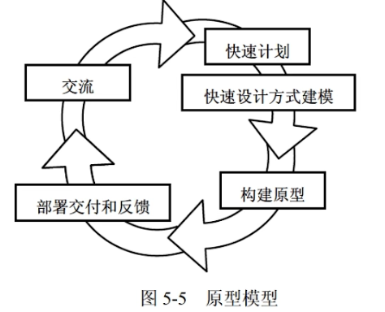

## 软件工程

### 能力成熟度模型 CMM

**5个成熟度等级**

- 初始级
  - 杂乱无章，几乎没有明确定义的步骤，依赖于个人的努力
- 可重复级（基本）
  - 建立了**基本的项目管理过程和实践**来追踪项目费用、进度和功能特性，**有必要的过程准则**来重复以前在同类项目中的成功
- 已定义级（标准）
  - 管理和工程两方面的软件过程已经**文档化、标准化**，并综合成整个软件开发组织的**标准软件过程**。所有项目都采用根据实际情况修改后得到的标准软件过程来开发和维护软件。
- 已管理级（主动应对、质量）
  - 制定了**软件过程和产品质量的详细度量标准**。软件过程的产品质量**都被开发组织的成员所理解控制**。
- 优化级（连续改进）
  - 加强了定量分析，通过来自**过程质量反馈和来自新概念、新技术的反馈**使过程能不断持续的改进。

### 能力成熟度模型集成

- 阶段式模型，关注组织成熟度，类似CMM
  - 初始的，过程不可预测且缺乏控制
  - 已管理的，为项目服务
  - 已定义的，为组织服务
  - 定量管理的，过程已度量和控制
  - 优化的，集中于过程改进
- 连续式模型，6级
  - CL0 未完成的
  - CL1 已执行的。过程将可标识的输入工作产品转换成可标识的输出工作产品。
  - CL2已管理的。已管理的过程的制度化
  - CL3已定义级。已定义过程的制度化
  - CL4定量管理。可定量管理的过程的制度化
  - CL5优化的。使用量化手段改变和优化过程域。

### 软件过程模型

软件开发全部过程、活动、任务的结构框架。

#### 瀑布模型（需求明确选这个）

- 将软件生命周期中的各个活动规定为依线性顺序连接的若干阶段的模型。
- 以项目的**阶段评审和文档控制**为手段有效对整个开发过程进行指导。
- 以文档进行驱动，**适合于软件需求很明确**的软件项目的模型。
- **优点**：容易理解、管理成本低。
- **缺点**：客户需求需很明确；需求、设计的错误往往只有**到了后期才能被发现**，对项目风险的控制能力较弱。

#### V模型

瀑布模型的变体，增加了**质量保证活动**，将验证确认活动应用于早起软件工程工作的方法。

#### 增量模型（快速构造可运行产品）

- 融合瀑布模型和原型实现的迭代特性。需求分段为一系列增量产品，每一增量分别开发。
- **优点**：第一个可交付版本所需时间、成本少；开发由增量表示的小系统所承担的风险不大。
- **缺点**：初始增量很重要，如果规划不好会造成后期不稳定。

#### 演化模型

迭代的过程模型，使得软件开发人员能够逐步开发出更完整的软件版本。适用于**对软件需求缺乏准确认识**的情况

##### 原型模型（捕获系统需求）

- 适合于**用户需求不清、需求经常变化**的情况。系统规模**不大不复杂**时可用。
- 快速低成本构建原型-征集改进意见-修改原型

##### 螺旋模型（庞大、复杂、高风险系统）

- 复杂大型软件，瀑布+演化模型，增加了**风险分析**
- 步骤
  - 制定计划。
  - 风险分析。分析方案，识别、消除风险。
  - 实施工程。实施软件开发，验证阶段性产品。
  - 用户评估。评估开发工作，提出修正建议，建立下一周期的开发计划

#### 喷泉模型

- 以用户需求为动力，以对象作为驱动的模型，适合于**面向对象**的开发方法。
- 使开发过程具有**迭代性和无间隙性**。无间隙性：开发活动没有明显边界，允许开发活动交叉、迭代地进行
- 需要大量开发人员，不利于开发管理。要求严格管理文档，使得审核难度加大。

#### 统一过程（UP）模型

用例和风险驱动，以架构为中心，迭代并且增量，由UML方法和工具支持。每个迭代有5个工作流。

- 起始阶段【生命周期目标】
- 精化阶段【生命周期架构】。需求分析和架构演进
- 构建阶段【初始运作功能】。关注构建，产生实现模型。
- 移交阶段【产品发布】。关注软件提交，产生软件增量。

#### 敏捷方法

目标：尽可能早、持续的对有价值的软件交付

##### 极限编程（XP）

- 4价值观：沟通、简单性、反馈、勇气
- 5原则：快速反馈、简单性假设、逐步修改、提倡更改、优质工作
- 12最佳实践：
  - 计划游戏(快速制定计划、随着细节的不断变化而完善)
  - 小型发布(系统的设计要能够尽可能早地交付)
  - 隐喻(找到合适的比喻传达信息)
  - 简单设计(只处理当前的需求，使设计保持简单)
  - 测试先行(先写测试代码，然后再编写程序)
  - 重构(重新审视需求和设计，重新明确地描述它们以符合新的和现有的需求)
  - 结对编程
  - 集体代码所有制
  - 持续集成(可以按日甚至按小时为客户提供可运行的版本)
  - 每周工作40个小时
  - 现场客户
  - 编码标准

##### 水晶法

- 每个项目都需要一套不同的策略、约定、方法论。

##### 并列争求法

- 使用迭代的方法，**把30天一次**的迭代称为一个“冲刺”，并按照需求的优先级别来实现产品。

##### 自适应软件开发ASD

- 6个基本的原则：
  - 有一个使命作为指导
  - 特征被视为客户价值的关键点
  - 过程中的等待是很重要的，因此“重做”与“做”同样关键
  - 变化不被视为改正，而是被视为对软件开发实际情况的调整
  - 确定的交付时间迫使开发人员认真考虑每一个生产的版本的关键需求
  - 风险也包含其中。

##### 敏捷统一过程AUP

- 每个AUP迭代执行以下活动：
  - 建模。建立对商业和问题域的模型表述，这些模型“足够好”即可，以便团队继续前进。
  - 实现。将模型翻译成源代码。
  - 测试。像XP一样，团队设计和执行一系列的测试来发现错误以保证源代码满足需求。
  - 部署。对软件增量的交付以及获取最终用户的反馈。
  - 配置及项目管理。着眼于变更管理、风险管理以及对团队的任一制品的控制。项目管理追踪和控制开发团队的工作进展并协调团队活动。
  - 环境管理。协调标准、工具以及适用于开发团队的支持技术等过程基础设施。
