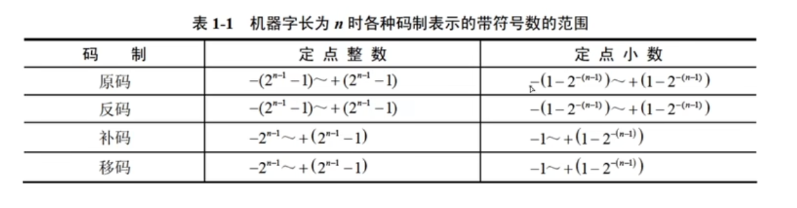

## 计算机系统

### 中央处理单元

- CPU的功能

  - **运算器**：数据处理
    - ALU 算数逻辑单元 算数+逻辑
    - AC 累加寄存器 为ALU提供工作区 运算器中至少有一个AC
    - DR 数据缓冲寄存器 中转站
    - PSW 状态条件寄存器 
  - **控制器**：控制整个CPU的工作。程序执行、操作控制、时间控制 。**保证程序正常执行，处理异常事件**
    - IR 指令寄存器 **暂存指令** 指令译码器根据IR内容产生操作指令
    - PC 程序计数器 **储存程序执行指令的地址** 顺序：pc = pc + 1 。
    - AR 地址寄存器 保存当前CPU所访问的内存单元地址
    - ID 指令译码器 指令 = 操作码 + 地址码 对操作码字段进行分析解释

  📒 从题中的总结

  - 执行指令： 内存 -> DR -> IR 。在这之前，从PC取指令
  - AC为ALU执行运算时**提供数据**并**暂存运算结果**
  - 控制器决定了计算机运行过程的自动化
  - 指令寄存器对用户是完全透明的（无法访问，无感知）

### 计算机基本单位

- 单位
  - 最小的数据单位 b。最小的储存单位 byte

|      |      |      |      |
| ---- | ---- | ---- | ---- |
| 位（比特） | bit  | b    |      |
| 字节       | byte | B    | 8    |
| 千字节     |      | KB   | 1024 |
| 兆字节     |      | MB   | 1024 |
| 吉字节     |      | GB   | 1024 |
| 太字节     |      | TB   | 1024 |

- 进制

#### 整数数据表示

- 各种数值在计算机中的表示形式称为机器数，二进制计数

- 带符号的机器数可用原码、反码、补码进行编码

- 原码：最高位符号位，0正1负

- 反码：最高位符号位，0正1负。正数的原码和反码相同，**负数反码是绝对值按位取反**

- 补码：最高位符号位，0正1负。正数的补码同原、反，负数的补码等于反码末位+1

- 移码：补码基础上，符号位取反

- x[补]\[补] = x[原]

- 表示范围

  

- ±0编码相同的是 移码和补码

- 常采用补码表示运算数据，**原因是补码可以简化计算机运算部件设计**（把减法当加法运算，减去一个数=加它的补码）

#### 浮点数表示

- **N = 2E * F**   E：阶码 F：尾数

  

  

📒 从题中的总结

## 程序设计语言

